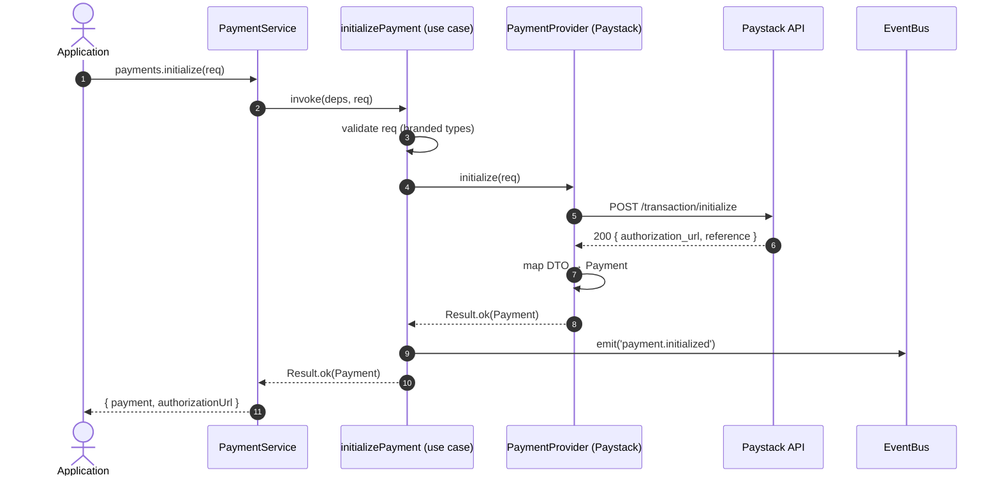
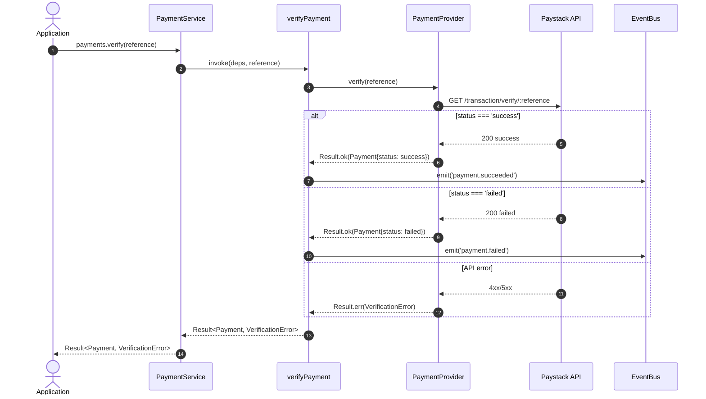
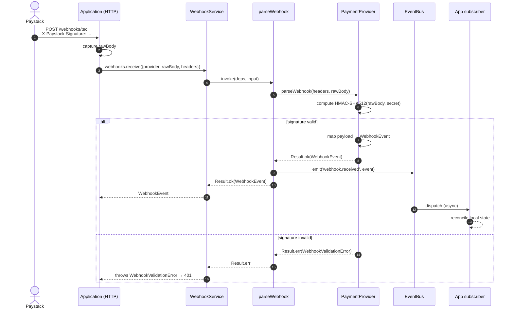
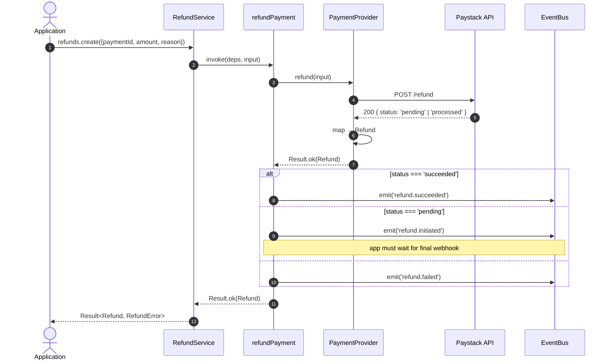
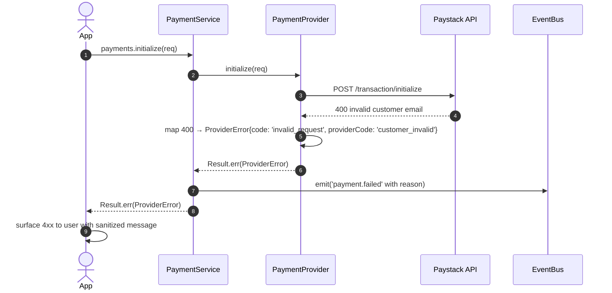
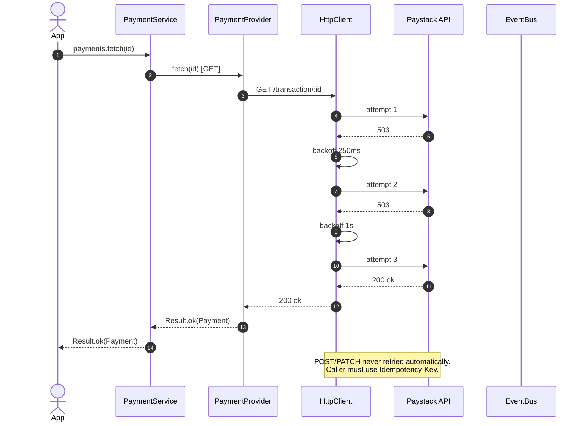

# ADR-0001: @tec/payment — Initial Architecture

> **Status:** PROPOSED — awaiting founder approval before implementation.
> **Date:** 2026-07-14
> **Author:** Principal Software Architect
> **Supersedes:** —
> **Target version:** 0.1.0 (initial scaffold)

---

## 0. Repository State Observed

```
/home/coollad49/stuffs/current/@tec/payment/
├── AGENTS.md          ← operating manual (read)
├── README.md          ← bun default
├── package.json       ← name="payment", module="index.ts", scripts.check-types
├── tsconfig.json      ← strict, ESNext, bundler resolution, bun types
├── index.ts           ← placeholder
├── bun.lock
├── node_modules/
└── .git/
```

**Observations relevant to architecture:**

1. `package.json` declares `"name": "payment"` — must be renamed to `"@tec/payment"` before publish.
2. `tsconfig.json` is strict, ESM (`"module": "Preserve"`), bundler-style resolution. Excellent foundation; we will keep and extend.
3. Runtime is **Bun** (dev) but the SDK must target **Node 18+** as a minimum runtime and be engine-neutral (no Bun-only APIs in published surface).
4. No build pipeline yet. ADR §19 prescribes the toolchain.
5. No folder structure beyond root files — clean slate.

---

## 1. Context

The Engineers Canvas operates multiple products that will each need to accept payments. Today, none share infrastructure. Each product would otherwise:

- Hand-roll Paystack (and later Flutterwave, OPay, Moniepoint, Stripe) integration code.
- Re-invent webhook verification, idempotency, error mapping, and retry logic.
- Couple itself permanently to one provider's API shape.

`@tec/payment` is the **shared kernel** that prevents that. It is a **framework-agnostic, runtime-agnostic TypeScript SDK** that exposes a single, stable public API to applications and hides every provider behind an adapter.

### 1.1 North-star principles

| # | Principle | Concretely means |
|---|-----------|-----------------|
| 1 | **Provider ignorance** | Applications never import a provider package. |
| 2 | **Open/Closed** | New provider = new adapter only. No app code changes. |
| 3 | **Dependency Inversion** | Domain depends on abstractions; adapters implement them. |
| 4 | **Determinism at the edge** | No silent retries, no hidden side-effects, no global state. |
| 5 | **Explicit > clever** | Every code path is auditable; the SDK never "magically" fixes user input. |
| 6 | **Stateless core** | The SDK does not own a database. State is the application's responsibility; the SDK surfaces events for the app to persist. |
| 7 | **Framework-agnostic** | No `express`, no `next`, no `hono`, no `aws-lambda` types in the public surface. |

---

## 2. Scope & Non-Goals

### In scope (v1)

- Initialize, verify, refund, list, and fetch payments.
- Webhook reception, validation, and normalized event parsing.
- One first-class provider: **Paystack**.
- Reference adapters (stub-only) for OPay, Flutterwave, Stripe, Moniepoint.
- Event bus, error hierarchy, typed config, structured logging, health check.

### Out of scope (v1)

- Recurring billing / subscriptions.
- Disputes / chargebacks workflow.
- Multi-currency conversion (FX).
- Payouts to third parties.
- Provider-side dashboard / analytics.
- Built-in persistence (DB / Redis / queue).
- Built-in HTTP server (apps bring their own framework).
- Browser bundle (Node + edge runtimes only).

### Future (v2+)

- Subscriptions, invoices, transfers.
- Optional persistence adapter (`@tec/payment-drizzle`, `@tec/payment-prisma`).
- Idempotency store adapter.
- Pluggable retry policy.

---

## 3. Architectural Style

**Hexagonal Architecture (Ports & Adapters)** combined with **Domain-Driven Design** tactical patterns (entity, value object, domain service, repository interface, domain event).

### 3.1 Layered view

```
┌────────────────────────────────────────────────────────────┐
│                  APPLICATION CODE                          │
│         (Next.js, NestJS, Hono, Express, Worker)           │
└────────────────────────┬───────────────────────────────────┘
                         │  imports
                         ▼
┌────────────────────────────────────────────────────────────┐
│              @tec/payment  (public API)                    │
│   createPaymentClient(config) → PaymentClient             │
└────────────────────────┬───────────────────────────────────┘
                         │
        ┌────────────────┼─────────────────┐
        ▼                ▼                 ▼
┌──────────────┐  ┌──────────────┐  ┌────────────────────┐
│  Application │  │    Domain    │  │   Infrastructure   │
│    Layer     │◄─┤    Layer     │─►│       Layer        │
│              │  │ (pure TS)    │  │  (HTTP, providers) │
│  Use cases   │  │  Entities    │  │  Adapters, ports   │
│  Orchestr.   │  │  VOs, events │  │  impls             │
└──────────────┘  └──────────────┘  └────────────────────┘
        ▲                ▲                 ▲
        └────────────────┴─────────────────┘
            Dependency Inversion: domain knows no infra
```

### 3.2 Dependency rules (enforced by lint / tsc)

- `domain/` imports **nothing** outside itself.
- `application/` may import `domain/` and shared types.
- `infrastructure/` may import `application/` and `domain/` but never the other way.
- `public-api/` is the only layer that exposes types to the outside world.
- No file outside `infrastructure/providers/*` may `import` an HTTP client, provider SDK, or framework module.

---

## 4. Folder Structure

```
@tec/payment/
├── package.json                       # name: @tec/payment
├── tsconfig.json                      # extends ./tsconfig.base.json
├── tsconfig.base.json                 # base compiler options
├── tsconfig.build.json                # emit build config
├── tsup.config.ts                     # build pipeline (ESM + CJS + .d.ts)
├── vitest.config.ts                   # test runner
├── eslint.config.js                   # lint rules
├── .editorconfig
├── .gitignore
├── .npmignore
├── README.md
├── LICENSE
├── CHANGELOG.md
│
├── src/
│   │
│   ├── public-api/                    # ONLY layer visible to consumers
│   │   ├── index.ts                   # barrel
│   │   ├── client.ts                  # createPaymentClient factory
│   │   ├── types.ts                   # re-exports of stable types
│   │   └── version.ts
│   │
│   ├── domain/                        # PURE — no IO, no framework
│   │   ├── money/
│   │   │   ├── money.ts               # value object
│   │   │   ├── currency.ts
│   │   │   └── money.test.ts
│   │   ├── payment/
│   │   │   ├── payment.ts             # entity
│   │   │   ├── payment-status.ts      # discriminated union / state machine
│   │   │   ├── payment-request.ts     # VO
│   │   │   ├── payment-method.ts
│   │   │   ├── payment-attempt.ts
│   │   │   └── payment.test.ts
│   │   ├── customer/
│   │   │   └── customer.ts
│   │   ├── refund/
│   │   │   ├── refund.ts
│   │   │   └── refund-reason.ts
│   │   ├── provider/
│   │   │   ├── provider.ts            # branded union
│   │   │   └── provider-capability.ts
│   │   ├── metadata/
│   │   │   └── metadata.ts            # branded JSON type
│   │   ├── reference/
│   │   │   └── payment-reference.ts   # branded string
│   │   ├── webhook/
│   │   │   ├── webhook-event.ts
│   │   │   └── webhook-signature.ts
│   │   └── events/
│   │       ├── payment-initialized.ts
│   │       ├── payment-pending.ts
│   │       ├── payment-succeeded.ts
│   │       ├── payment-failed.ts
│   │       ├── refund-initiated.ts
│   │       ├── refund-succeeded.ts
│   │       ├── refund-failed.ts
│   │       ├── webhook-received.ts
│   │       ├── verification-completed.ts
│   │       └── event-base.ts
│   │
│   ├── application/                   # Use cases (orchestration)
│   │   ├── ports/
│   │   │   ├── payment-provider.ts    # provider contract
│   │   │   ├── http-client.ts
│   │   │   ├── logger.ts
│   │   │   ├── clock.ts
│   │   │   ├── id-generator.ts
│   │   │   ├── event-bus.ts
│   │   │   └── webhook-verifier.ts
│   │   ├── use-cases/
│   │   │   ├── initialize-payment.ts
│   │   │   ├── verify-payment.ts
│   │   │   ├── fetch-payment.ts
│   │   │   ├── list-payments.ts
│   │   │   ├── refund-payment.ts
│   │   │   ├── parse-webhook.ts
│   │   │   └── health-check.ts
│   │   ├── services/
│   │   │   ├── payment-service.ts     # façade
│   │   │   ├── refund-service.ts
│   │   │   └── webhook-service.ts
│   │   ├── event-bus/
│   │   │   ├── in-memory-event-bus.ts
│   │   │   └── subscription.ts
│   │   └── use-cases/*.test.ts
│   │
│   ├── infrastructure/                # IO, adapters, side-effects
│   │   ├── http/
│   │   │   ├── fetch-http-client.ts   # default impl using fetch
│   │   │   ├── retry-policy.ts
│   │   │   ├── circuit-breaker.ts
│   │   │   └── rate-limiter.ts
│   │   ├── providers/
│   │   │   ├── paystack/
│   │   │   │   ├── paystack-adapter.ts
│   │   │   │   ├── paystack-types.ts
│   │   │   │   ├── paystack-mapper.ts     # provider DTO → domain
│   │   │   │   ├── paystack-webhook.ts
│   │   │   │   └── paystack-adapter.test.ts
│   │   │   ├── stripe/                   # stub v1, full v2
│   │   │   │   └── stripe-adapter.ts
│   │   │   ├── flutterwave/              # stub
│   │   │   │   └── flutterwave-adapter.ts
│   │   │   ├── opay/                     # stub
│   │   │   │   └── opay-adapter.ts
│   │   │   └── moniepoint/               # stub
│   │   │       └── moniepoint-adapter.ts
│   │   ├── webhook/
│   │   │   ├── hmac-webhook-verifier.ts
│   │   │   └── webhook-router.ts
│   │   ├── logging/
│   │   │   ├── console-logger.ts
│   │   │   └── noop-logger.ts
│   │   ├── clock/
│   │   │   └── system-clock.ts
│   │   ├── id/
│   │   │   └── ulid-id-generator.ts
│   │   └── persistence/                  # v2 — placeholder dir
│   │       └── README.md
│   │
│   ├── shared/
│   │   ├── result/
│   │   │   ├── result.ts               # Result<T, E> type
│   │   │   └── result.test.ts
│   │   ├── validation/
│   │   │   ├── validator.ts            # tiny schema port
│   │   │   └── validation-error.ts
│   │   ├── types/
│   │   │   ├── brand.ts
│   │   │   ├── deep-readonly.ts
│   │   │   └── async-iterable.ts
│   │   └── utils/
│   │       ├── invariant.ts
│   │       └── retry.ts
│   │
│   └── errors/
│       ├── payment-error.ts            # base
│       ├── configuration-error.ts
│       ├── provider-unavailable-error.ts
│       ├── webhook-validation-error.ts
│       ├── refund-error.ts
│       ├── network-error.ts
│       ├── timeout-error.ts
│       ├── verification-error.ts
│       ├── validation-error.ts
│       └── error-codes.ts
│
├── tests/
│   ├── integration/
│   │   ├── paystack.spec.ts
│   │   └── webhook-flow.spec.ts
│   ├── fixtures/
│   │   ├── paystack-initialize.json
│   │   └── paystack-webhook.json
│   └── contract/
│       └── provider-contract.spec.ts   # every adapter must pass
│
├── docs/
│   ├── architecture.md                 # this document (compiled)
│   ├── public-api.md
│   ├── extension-guide.md
│   ├── provider-guide.md
│   ├── migration-guide.md
│   ├── versioning.md
│   └── adr/
│       ├── 0001-initial-architecture.md
│       └── template.md
│
└── scripts/
    ├── verify-build.sh
    └── publish-checklist.sh
```

### 4.1 Package organization rationale

- **Feature folders inside each layer** (not "controllers/services/repositories"). Easy to delete, easy to navigate.
- **Provider adapters are isolated** so a single misbehaving adapter cannot pollute the rest of the SDK.
- **`public-api` is a firewall**: any accidental internal export must be moved here to be visible. Forces conscious API design.

---

## 5. Public API

### 5.1 Surface (entrypoint: `@tec/payment`)

```ts
// The ONLY entrypoint. Everything else is internal.
import {
  createPaymentClient,    // factory
  PaymentClient,          // type of returned object
  PaymentError,           // error class
  ConfigurationError,
  WebhookValidationError,
  RefundError,
  // types only
  Payment,
  PaymentRequest,
  PaymentStatus,
  PaymentEvent,
  WebhookEvent,
  Refund,
  Money,
  Currency,
  Provider,
  Metadata,
} from '@tec/payment';
```

**Rule:** `src/public-api/index.ts` is the *only* file that re-exports internals. Every other folder is `internal` by convention; TypeScript path mappings in `tsconfig.json` make them physically unreachable to consumers in published builds.

### 5.2 The `PaymentClient` object

```ts
interface PaymentClient {
  readonly payments: PaymentService;
  readonly refunds: RefundService;
  readonly webhooks: WebhookService;
  readonly events: EventSubscription;
  readonly providers: ProviderRegistry;
  health(): Promise<HealthReport>;
}
```

Each service is a thin façade over use cases. The application code is short and obvious.

### 5.3 Example usage (target shape — illustrative only)

```ts
const tec = createPaymentClient({
  providers: {
    paystack: { secretKey: process.env.PAYSTACK_SECRET! },
  },
  defaultProvider: 'paystack',
  logging: { level: 'info' },
});

// 1. Initialize
const { payment, authorizationUrl } = await tec.payments.initialize({
  amount: { amount: 50_000, currency: 'NGN' }, // 500.00 NGN (minor units)
  customer: { email: 'a@b.com' },
  reference: 'order-9001',
  callbackUrl: 'https://app/verify',
});

// 2. Verify (after redirect)
const verified = await tec.payments.verify('order-9001');

// 3. Webhook
app.post('/webhooks/tec', async (req) => {
  const event = await tec.webhooks.receive({
    provider: 'paystack',
    rawBody: req.rawBody,
    signature: req.headers['x-paystack-signature'],
  });
  // emit normalized event to app
});
```

**Design choices baked in:**

- **No callbacks.** `Promise<Result>` style throughout.
- **Branded primitives** (`amount` is `Money`, not `{ amount: number }`) so app code cannot accidentally pass a float of NGN in major units.
- **`reference` is app-owned.** The SDK never invents one; the app provides it. This makes idempotency controllable.

---

## 6. Internal API

Internal types live in `domain/` and `application/ports/`. They are *not* exported from the public barrel. They are documented for adapter authors only (see `docs/extension-guide.md`).

Internal API categories:

- **Ports** — interfaces in `application/ports/*.ts` (e.g. `PaymentProvider`).
- **Use cases** — pure functions in `application/use-cases/*.ts` (e.g. `initializePayment(deps, input): Promise<Result<...>>`).
- **Domain events** — frozen interfaces in `domain/events/*.ts`.
- **Mappers** — `*-mapper.ts` in each provider folder translate provider DTOs ↔ domain.

---

## 7. Domain Layer

### 7.1 Design rules

1. **No IO.** No `fetch`, no `Date.now()` (use injected `Clock`), no `Math.random()` (use injected `IdGenerator`).
2. **No provider types leak.** A Paystack response shape never appears in `domain/`.
3. **All VOs are immutable** and have structural equality.
4. **All entities carry an `id`, `providerId`, `createdAt`, and `version`** (optimistic concurrency placeholder for v2).

### 7.2 `Money` (value object)

```ts
// Money is always stored in MINOR units (kobo, cents, etc.) as BigInt-safe number.
interface Money {
  readonly amount: number;     // integer, minor units, > 0
  readonly currency: Currency; // ISO 4217
}
```

**Why BigInt-safe `number` and not `bigint`?**

- Paystack/Flutterwave/OPay/Stripe all use numbers (or strings) for minor units in their public APIs.
- `bigint` breaks JSON serialization without a custom reviver, hurting webhook payloads and logs.
- We enforce `integer` and `> 0` at the boundary; BigInt is overkill given the range (max 2^53-1 minor units ≈ $90T).

**Why minor units?** Floating-point money is a CV-generating machine. Major units would force `Decimal.js` in the public type.

### 7.3 `Currency`

```ts
type Currency = 'NGN' | 'GHS' | 'ZAR' | 'KES' | 'USD' | 'EUR' | 'GBP' | (string & { __brand: 'Currency' });
```

The `string & { __brand }` intersection allows unknown ISO codes at compile time while preventing accidental non-currency string assignment.

### 7.4 `PaymentRequest` (input VO)

```ts
interface PaymentRequest {
  readonly amount: Money;
  readonly customer: CustomerReference;
  readonly reference: PaymentReference;   // app-supplied, unique per attempt
  readonly callbackUrl?: string;          // for redirect flows
  readonly channels?: ReadonlyArray<PaymentChannel>;
  readonly metadata?: Metadata;
  readonly expiresAt?: Date;              // optional TTL
}
```

### 7.5 `Payment` (entity)

```ts
interface Payment {
  readonly id: PaymentId;                  // provider-issued
  readonly providerId: Provider;
  readonly reference: PaymentReference;    // app-supplied
  readonly amount: Money;
  readonly status: PaymentStatus;
  readonly customer: Customer;
  readonly authorizationUrl?: string;      // redirect URL, when applicable
  readonly channel?: PaymentChannel;
  readonly attempts: ReadonlyArray<PaymentAttempt>;
  readonly metadata: Metadata;
  readonly createdAt: Date;
  readonly updatedAt: Date;
  readonly paidAt?: Date;
  readonly failureReason?: FailureReason;
}
```

### 7.6 `PaymentStatus` (state machine)

```
        ┌─────────────────┐
        │   initialized   │
        └────────┬────────┘
                 │
        ┌────────▼────────┐
        │     pending     │◄─────────┐
        └──┬──────┬───────┘          │
           │      │                  │
   ┌───────▼┐  ┌──▼─────────┐  ┌─────┴──────┐
   │success │  │  failed    │  │ abandoned  │
   └────────┘  └────────────┘  └────────────┘
                 │
            ┌────▼─────┐
            │ refunded │
            └──────────┘
```

Implemented as discriminated union for type-safe pattern matching:

```ts
type PaymentStatus =
  | { kind: 'initialized' }
  | { kind: 'pending' }
  | { kind: 'success'; paidAt: Date }
  | { kind: 'failed'; reason: FailureReason; failedAt: Date }
  | { kind: 'abandoned' }
  | { kind: 'refunded'; refundedAt: Date; refundId: RefundId };
```

**Why discriminated union instead of enum?** Forces the caller to handle every state at compile time, and lets us attach state-specific data (`reason`, `paidAt`).

### 7.7 `PaymentAttempt`

```ts
interface PaymentAttempt {
  readonly id: string;            // provider attempt id
  readonly status: PaymentStatus;
  readonly channel: PaymentChannel;
  readonly ipAddress?: string;
  readonly fees?: Money;
  readonly authorizationCode?: string; // for charging later (recurring v2)
  readonly bin?: string;              // first 6 of card
  readonly last4?: string;
  readonly bank?: string;
  readonly rawResponse: Readonly<Record<string, unknown>>; // provider envelope
  readonly attemptedAt: Date;
}
```

### 7.8 `Customer`

```ts
interface Customer {
  readonly id: string;            // provider customer id
  readonly email: string;
  readonly phone?: string;
  readonly name?: string;
  readonly metadata?: Metadata;
}
```

### 7.9 `CustomerReference` (input)

```ts
type CustomerReference =
  | { kind: 'new'; email: string; phone?: string; name?: string }
  | { kind: 'existing'; providerCustomerId: string }
  | { kind: 'inline'; customer: Customer };
```

### 7.10 `Refund`

```ts
interface Refund {
  readonly id: RefundId;
  readonly paymentId: PaymentId;
  readonly providerId: Provider;
  readonly amount: Money;            // partial or full
  readonly reason: RefundReason;
  readonly status: RefundStatus;
  readonly initiatedAt: Date;
  readonly completedAt?: Date;
  readonly failureReason?: FailureReason;
  readonly metadata?: Metadata;
}

type RefundStatus =
  | { kind: 'pending' }
  | { kind: 'processing' }
  | { kind: 'succeeded'; settledAt: Date }
  | { kind: 'failed'; reason: FailureReason };
```

### 7.11 `Provider`

```ts
type Provider = 'paystack' | 'stripe' | 'flutterwave' | 'opay' | 'moniepoint' | (string & { __brand: 'Provider' });
```

### 7.12 `PaymentReference` (branded)

```ts
type PaymentReference = string & { readonly __brand: 'PaymentReference' };
```

Factory `PaymentReference.of(raw: string)` validates format (alphanumeric + `_-`, length 6-100). Rejects empties, rejects `'reference'` literals that aren't pre-validated.

### 7.13 `Metadata`

```ts
type Metadata = Readonly<Record<string, string | number | boolean | null>>;
```

Strict shape: prevents apps from stuffing nested objects that some providers strip anyway.

### 7.14 `WebhookEvent`

```ts
interface WebhookEvent<TPayload = unknown> {
  readonly id: string;                   // provider event id
  readonly provider: Provider;
  readonly type: WebhookEventType;       // normalized
  readonly originalType: string;         // raw provider type
  readonly createdAt: Date;
  readonly receivedAt: Date;             // SDK receive time
  readonly payload: TPayload;            // normalized, provider-agnostic
  readonly raw: Readonly<Record<string, unknown>>;
}

type WebhookEventType =
  | 'payment.initialized'
  | 'payment.pending'
  | 'payment.succeeded'
  | 'payment.failed'
  | 'refund.initiated'
  | 'refund.succeeded'
  | 'refund.failed'
  | 'unknown';
```

### 7.15 `PaymentEvent` (internal domain event)

```ts
interface PaymentEvent {
  readonly type: PaymentEventType;
  readonly payment: Payment;
  readonly occurredAt: Date;
  readonly correlationId: string;
}

type PaymentEventType =
  | 'payment.initialized' | 'payment.pending'
  | 'payment.succeeded' | 'payment.failed'
  | 'refund.initiated'    | 'refund.succeeded' | 'refund.failed'
  | 'webhook.received'    | 'verification.completed';
```

**Difference between `WebhookEvent` and `PaymentEvent`?**

- `WebhookEvent` is what the SDK emits from a webhook POST. It is the *raw receipt*.
- `PaymentEvent` is what use cases emit internally after successfully applying a webhook's effect (e.g. updating payment status). It is *the resulting domain mutation*.

---

## 8. Application Layer

### 8.1 Use cases — signature convention

Every use case is a pure function with explicit dependencies:

```ts
type UseCase<Input, Output, Deps = unknown> = (
  deps: Deps,
  input: Input
) => Promise<Result<Output, PaymentError>>;
```

`Result<T, E>` is a discriminated union (`{ ok: true; value: T } | { ok: false; error: E }`) — never throw for expected errors. Throw only for programmer errors (invariant violations).

### 8.2 Use case list

| Use case | Purpose | Dependencies |
|----------|---------|--------------|
| `initializePayment` | Create a new payment with the configured provider | `PaymentProvider`, `IdGenerator`, `Clock`, `EventBus` |
| `verifyPayment` | Confirm a payment's status via provider API | `PaymentProvider`, `EventBus` |
| `fetchPayment` | Retrieve a payment by id or reference | `PaymentProvider` |
| `listPayments` | List payments with pagination + filters | `PaymentProvider` |
| `refundPayment` | Initiate a refund (full or partial) | `PaymentProvider`, `EventBus` |
| `parseWebhook` | Verify signature + normalize provider event | `PaymentProvider`, `EventBus` |
| `healthCheck` | Probe provider availability | `PaymentProvider` |

### 8.3 Services (façades)

Services compose use cases and apply the event bus:

```ts
class PaymentService {
  constructor(
    private readonly provider: PaymentProvider,
    private readonly bus: EventBus,
    private readonly clock: Clock,
  ) {}
  initialize(input: PaymentRequest): Promise<Result<Payment, PaymentError>> { /* ... */ }
  verify(reference: PaymentReference): Promise<Result<Payment, VerificationError>> { /* ... */ }
}
```

### 8.4 Ports

`application/ports/` defines the contracts adapters must implement.

```ts
// payment-provider.ts
interface PaymentProvider {
  readonly id: Provider;
  readonly capabilities: ProviderCapabilities;
  initialize(req: PaymentRequest): Promise<Result<Payment, ProviderError>>;
  verify(reference: PaymentReference): Promise<Result<Payment, ProviderError>>;
  fetch(id: PaymentId): Promise<Result<Payment, ProviderError>>;
  list(query: ListQuery): Promise<Result<Page<Payment>, ProviderError>>;
  refund(input: RefundRequest): Promise<Result<Refund, ProviderError>>;
  parseWebhook(headers: Readonly<Record<string, string>>, rawBody: string | Buffer): Promise<Result<WebhookEvent, WebhookValidationError>>;
  health(): Promise<HealthStatus>;
}
```

---

## 9. Infrastructure Layer

### 9.1 HTTP client

`FetchHttpClient` is the default implementation. It wraps native `fetch` (Node 18+, Bun, edge). It enforces:

- Absolute URL construction from a base URL set per provider.
- Timeout via `AbortController` (configurable, default 30s).
- One automatic retry for idempotent verbs (GET, HEAD) on 5xx / network errors, with exponential backoff (default 250ms, 1s, 4s).
- No retry on POST/PATCH/DELETE (callers opt-in via `Idempotency-Key` header).
- Correlation ID header propagation (`X-TEC-Correlation-Id`).

The `HttpClient` port lets apps substitute `undici`, `axios`, or a mock for tests.

### 9.2 Provider adapter pattern

```
infrastructure/providers/paystack/
  ├── paystack-adapter.ts         # implements PaymentProvider
  ├── paystack-types.ts           # provider DTOs (NEVER exported)
  ├── paystack-mapper.ts          # DTO → domain
  ├── paystack-webhook.ts         # signature + parse
  └── paystack-adapter.test.ts
```

**Adapter responsibilities:**

- Translate domain request → provider HTTP request.
- Send via injected `HttpClient`.
- Translate provider response → domain `Result<Payment, ProviderError>`.
- Implement webhook signature verification using provider's algorithm.
- Map provider events to normalized `WebhookEventType`.

**Adapter non-responsibilities:**

- Retries (HTTP client does this).
- Logging shape (logger does this).
- Event emission (use case does this).
- State storage (out of scope).

### 9.3 Webhook verification

`infrastructure/webhook/hmac-webhook-verifier.ts` is the default for providers using HMAC-SHA512 (Paystack). Other providers (Stripe uses `Stripe-Signature` with timestamped HMAC) get their own verifier inside their adapter folder.

Signature verification **always** uses the **raw body** bytes — adapters must be told by the application to deliver `req.rawBody`. The public API documents this contract loudly.

### 9.4 Logging

`Logger` port with `ConsoleLogger` (default JSON-line output) and `NoopLogger` (for tests). Levels: `debug | info | warn | error`. Logger never receives secrets; messages are constructed by the SDK with redaction helpers (e.g. `redact({ authorization: '...' })`).

### 9.5 Clock

`Clock` port. `SystemClock` returns `new Date()`. Tests inject a `FixedClock`.

### 9.6 ID generator

`IdGenerator` port. Default `UlidIdGenerator` for internal correlation/event ids. **Not** used to generate payment references (those are app-supplied).

### 9.7 Event bus

`InMemoryEventBus` (sync, single-process). v2 may add `RedisEventBus` / `NatsEventBus` adapters. Subscribers are typed:

```ts
bus.on('payment.succeeded', async (event) => { /* fully typed */ });
```

---

## 10. Provider Contract — `PaymentProvider`

### 10.1 Why each method exists

| Method | Why |
|--------|-----|
| `initialize(req)` | First half of the lifecycle. Provider returns a `Payment` with `authorizationUrl` (for redirect) or inline data. |
| `verify(reference)` | After redirect, the app asks the provider directly — never trusts the redirect query params. |
| `fetch(id)` | Look up a single payment by provider-assigned id. |
| `list(query)` | Reconciliation, admin dashboards, reconciliation jobs. |
| `refund(input)` | Reverse a successful payment, fully or partially. |
| `parseWebhook(headers, rawBody)` | Validate signature, return normalized event or throw. |
| `health()` | Liveness probe — for `/health` endpoints and orchestrators. |

**Why no `cancel`?** Cancellations are provider-specific (Paystack: not supported for non-pending; Stripe: `PaymentIntent.cancel()`). Cancellation is expressed as "do nothing" — the payment expires naturally. If v2 needs explicit cancel, we add it as an optional capability (`ProviderCapabilities.cancel = true`).

### 10.2 `ProviderCapabilities`

```ts
interface ProviderCapabilities {
  readonly supportsAuthorizationUrl: boolean;
  readonly supportsRecurring: boolean;        // v2
  readonly supportsPartialRefund: boolean;
  readonly supportsWebhooks: boolean;
  readonly maxAmount?: Money;
  readonly supportedCurrencies: ReadonlyArray<Currency>;
  readonly supportedChannels: ReadonlyArray<PaymentChannel>;
}
```

Apps can query `client.providers.get('paystack').capabilities` to render the right UI.

---

## 11. Sequence Diagrams

### 11.1 Initialize Payment



### 11.2 Verify Payment



### 11.3 Webhook Processing



### 11.4 Refund



### 11.5 Failed Payment



### 11.6 Retry (caller-controlled, automatic for idempotent reads)



---

## 12. Event System

### 12.1 Type taxonomy

| Event | Source | Payload |
|-------|--------|---------|
| `payment.initialized` | use case | `Payment` |
| `payment.pending` | use case / webhook | `Payment` |
| `payment.succeeded` | use case / webhook | `Payment` |
| `payment.failed` | use case / webhook | `Payment` + `FailureReason` |
| `refund.initiated` | use case | `Refund` |
| `refund.succeeded` | use case / webhook | `Refund` |
| `refund.failed` | use case / webhook | `Refund` + `FailureReason` |
| `webhook.received` | webhook use case | `WebhookEvent` |
| `verification.completed` | verify use case | `Payment` |

### 12.2 Bus contract

```ts
interface EventBus {
  emit<T extends PaymentEventType>(type: T, event: PaymentEventOf<T>): Promise<void>;
  on<T extends PaymentEventType>(type: T, handler: Handler<T>): Unsubscribe;
  onAny(handler: (event: PaymentEvent) => void): Unsubscribe;
}

type Unsubscribe = () => void;
```

- Handlers are async. The bus awaits each handler in registration order; exceptions are caught, logged, and **do not** break the chain (failure isolation).
- Handlers run in series by default. v2 may add a `parallel` option.
- The bus is **fire-and-forget** from the caller's perspective — `emit()` resolves when handlers are scheduled, not when they finish.

### 12.3 Why an event system?

- Apps need to **react** to payment state changes (send email, update DB, notify Slack).
- Without a bus, apps duplicate "what to do when X happens" in every webhook handler, refund flow, etc.
- The bus is the seam where the SDK's *technical* events become the *application's* business events.

---

## 13. Error Hierarchy

### 13.1 Class diagram

```
PaymentError (abstract, extends Error)
├── ConfigurationError           # bad config at createPaymentClient()
├── ValidationError              # bad input from app
├── ProviderUnavailableError     # provider down or unreachable
├── NetworkError                 # HTTP failure, DNS, TLS
├── TimeoutError                 # AbortController fired
├── WebhookValidationError       # signature mismatch, malformed body
├── VerificationError            # verify() couldn't confirm state
├── RefundError                  # refund rejected by provider
├── ProviderError                # generic provider 4xx/5xx with providerCode
│   ├── ProviderBadRequestError
│   ├── ProviderUnauthorizedError
│   ├── ProviderNotFoundError
│   ├── ProviderConflictError
│   └── ProviderRateLimitError
└── InternalError                # SDK bug; should never happen
```

### 13.2 Shape

```ts
abstract class PaymentError extends Error {
  abstract readonly code: ErrorCode;
  abstract readonly category: ErrorCategory;
  readonly cause?: unknown;
  readonly provider?: Provider;
  readonly providerCode?: string;
  readonly correlationId: string;
  readonly isRetryable: boolean;
  readonly httpStatus: number;        // suggested response status
  readonly meta?: Readonly<Record<string, unknown>>;
}

type ErrorCategory =
  | 'configuration' | 'validation'
  | 'provider' | 'network' | 'timeout'
  | 'webhook' | 'refund' | 'verification'
  | 'internal';
```

### 13.3 When each is thrown

| Error | When |
|-------|------|
| `ConfigurationError` | Missing secret, unknown provider, conflicting options. Thrown at `createPaymentClient()`. |
| `ValidationError` | Bad request shape (e.g. negative amount, empty reference). Returned as `Result.err`. |
| `NetworkError` | DNS failure, TCP reset, TLS error. Returned as `Result.err`, `isRetryable: true`. |
| `TimeoutError` | Provider exceeded `timeoutMs`. Returned as `Result.err`, `isRetryable: true`. |
| `ProviderUnavailableError` | 5xx after all retries. Returned as `Result.err`, `isRetryable: true`. |
| `ProviderError` | 4xx with provider's error message. Returned as `Result.err`, `isRetryable: false` (except 429). |
| `ProviderRateLimitError` | 429. Returned as `Result.err`, `isRetryable: true`. |
| `WebhookValidationError` | Bad signature, expired timestamp, malformed body. **Thrown** (not Result) — apps should respond 401/400. |
| `VerificationError` | Provider API call to verify failed. Returned as `Result.err`. |
| `RefundError` | Refund rejected. Returned as `Result.err`. |
| `InternalError` | SDK invariant broken. Thrown. Should open a bug report. |

### 13.4 Why `Result` for some, `throw` for others?

- **Result** for *expected* failures (provider rejected the request). Apps must handle these as data.
- **throw** for *unexpected* / *unrecoverable* (bad config, SDK bug, signature invalid). Throwing is the right signal: caller should crash, not silently continue.

---

## 14. Configuration System

### 14.1 `createPaymentClient(config)` shape

```ts
interface PaymentClientConfig {
  readonly providers: ProviderConfigs;       // keyed by Provider
  readonly defaultProvider?: Provider;       // used when call doesn't specify
  readonly logging?: LoggingConfig;
  readonly http?: HttpClientConfig;
  readonly retry?: RetryConfig;
  readonly eventBus?: EventBus;              // inject custom bus
  readonly clock?: Clock;                    // inject for tests
  readonly idGenerator?: IdGenerator;        // inject for tests
  readonly logger?: Logger;                  // inject custom logger
  readonly httpClient?: HttpClient;          // inject custom HTTP impl
  readonly middleware?: ReadonlyArray<Middleware>; // request/response interceptors
}

type ProviderConfigs = {
  readonly [K in Provider]?: ProviderConfig;
};

interface ProviderConfig {
  readonly secretKey: string;
  readonly publicKey?: string;
  readonly webhookSecret?: string;
  readonly baseUrl?: string;          // override for sandbox
  readonly timeoutMs?: number;        // default 30_000
  readonly enabled?: boolean;         // default true
  readonly options?: Readonly<Record<string, unknown>>; // provider-specific
}
```

### 14.2 Configuration resolution order

1. Caller-supplied value (DI / explicit).
2. Default value from SDK.
3. **Error** if neither.

Configuration is **immutable after construction**. To change a secret, build a new client.

### 14.3 Environment variable support

`createPaymentClient.fromEnv()` factory reads:

```
TEC_PAYMENT_DEFAULT_PROVIDER=paystack
TEC_PAYMENT_LOGGING_LEVEL=info
TEC_PAYMENT_PAYSTACK_SECRET_KEY=sk_...
TEC_PAYMENT_PAYSTACK_WEBHOOK_SECRET=...
TEC_PAYMENT_STRIPE_SECRET_KEY=sk_...
```

This is a **thin convenience wrapper**, not a magic layer. The plain `createPaymentClient()` API is the canonical one.

### 14.4 Multi-provider selection at call site

```ts
await tec.payments.initialize(req);                          // uses defaultProvider
await tec.payments.initialize(req, { provider: 'stripe' });  // explicit
await tec.providers.get('paystack').capabilities;            // introspect
```

---

## 15. Validation Strategy

### 15.1 Approach: lightweight, schema-agnostic

The SDK does **not** depend on Zod / Valibot / ArkType in its public surface. Instead:

- A `Validator<T>` port is defined in `application/ports/`.
- Default impl is a hand-rolled validator built on `shared/validation/`.
- Adapters may *additionally* use Zod internally for parsing provider responses — that's fine because it's inside `infrastructure/`.

### 15.2 Why no Zod by default?

- Avoids 50KB+ bundle hit for the smallest consumers.
- Keeps the SDK dependency tree minimal (Stripe SDK's own tree is famously thin).
- Public API types already express the contract; runtime validation is for boundary objects (provider responses, raw webhook bodies) only.

### 15.3 What gets validated where

| Boundary | Validator |
|----------|-----------|
| App → SDK (request inputs) | Branded types + light checks at service boundary |
| SDK → Provider (HTTP body) | Hand-rolled schema in adapter |
| Provider → SDK (HTTP response) | Hand-rolled schema in adapter (`parsePaystackResponse()`) |
| Provider → SDK (webhook body) | Same, plus HMAC verification |

### 15.4 Optional strict mode

`createPaymentClient({ validation: 'strict' })` enables deeper runtime checks (email format, ISO 3166 country, URL parse). Default is `'standard'`.

---

## 16. Logging Strategy

### 16.1 `Logger` port

```ts
interface Logger {
  debug(message: string, context?: LogContext): void;
  info(message: string, context?: LogContext): void;
  warn(message: string, context?: LogContext): void;
  error(message: string, error?: unknown, context?: LogContext): void;
  child(bindings: LogContext): Logger;
}

type LogContext = Readonly<Record<string, string | number | boolean>>;
```

### 16.2 Default — `ConsoleLogger`

- JSON-line output (one event per line) for ingestion by Datadog/Loki/CloudWatch.
- ISO 8601 timestamps.
- Auto-bound: `provider`, `correlationId`, `operation`, `reference` when present.
- Sensitive fields auto-redacted: `authorization`, `secret`, `password`, `signature`, `card`.

### 16.3 `NoopLogger`

For tests, CI noise reduction.

### 16.4 What the SDK logs

- **info**: lifecycle events (`payment.initialized`, `webhook.received`).
- **debug**: full request/response (with redaction) at `level: 'debug'`.
- **warn**: retries, 4xx (non-fatal).
- **error**: 5xx, signature failures, internal errors.

### 16.5 What the SDK never logs

- Raw card numbers, CVV, PINs.
- Full secret keys (only the last 4 chars or a hash).
- Raw request/response bodies when `level: 'info'`.

---

## 17. Testing Strategy

### 17.1 Three-tier pyramid

```
                ┌──────────────┐
                │  Contract    │   ← every adapter passes the same suite
                │   tests      │
                └──────┬───────┘
                       │
              ┌────────▼─────────┐
              │   Integration    │   ← against provider sandbox
              │     tests        │
              └────────┬─────────┘
                       │
         ┌─────────────▼──────────────┐
         │       Unit tests           │   ← domain, use cases, ports
         └────────────────────────────┘
```

### 17.2 Test tooling

- **Runner:** `vitest` (Bun-compatible, fast, ESM-native, excellent TS).
- **Mocking:** built-in `vi.fn()` + `vi.spyOn()`; no `sinon`/`nock`.
- **HTTP mocking:** `msw` (Mock Service Worker) for adapter tests — it speaks fetch natively.
- **Coverage:** `vitest --coverage` with v8 provider; target ≥ 90% on `domain/`, ≥ 80% overall.

### 17.3 Contract test (`tests/contract/provider-contract.spec.ts`)

A single test suite that **every** provider adapter must pass. It verifies:

- `initialize` happy path produces a `Payment` with `authorizationUrl`.
- `initialize` with invalid amount returns `ValidationError`.
- `verify` for a known reference returns the right status.
- `fetch` returns the same `Payment` after `initialize`.
- `refund` of a successful payment returns a `Refund` with `succeeded` status.
- `parseWebhook` rejects bad signatures.
- `parseWebhook` returns a normalized `WebhookEvent` for a known fixture.
- `health` returns a structured `HealthStatus`.

This suite is the *objective definition* of "a working provider".

### 17.4 Fixtures

Real provider payloads (anonymized) committed to `tests/fixtures/`. Updating a fixture is a code review event — it means a provider changed shape.

### 17.5 What is NOT unit-tested

- Third-party HTTP behavior (covered by `msw`).
- Provider sandbox behavior (covered by integration tests against the real sandbox).
- `ConsoleLogger` formatting (covered by a single snapshot test).

---

## 18. Extension Strategy

### 18.1 Adding a new provider

```
src/infrastructure/providers/<name>/
  ├── <name>-adapter.ts
  ├── <name>-types.ts
  ├── <name>-mapper.ts
  ├── <name>-webhook.ts
  └── <name>-adapter.test.ts
```

Then:

1. Register the provider in `src/infrastructure/providers/index.ts` (internal registry).
2. Add the literal to the `Provider` branded type.
3. Add the `TEC_PAYMENT_<NAME>_SECRET_KEY` env var to the `fromEnv()` factory.
4. Add a stub to `tests/contract/provider-contract.spec.ts` so the contract test is automatically applied.

**Zero changes to:** `domain/`, `application/`, `public-api/`, or any application code.

### 18.2 Adding a new use case

1. Add use case file to `application/use-cases/`.
2. Add method to the appropriate `*Service` in `application/services/`.
3. Re-export from `public-api/types.ts` if the return type should be public.
4. Add unit tests + integration test.

### 18.3 Adding a new event

1. Add event type to `domain/events/`.
2. Add to `PaymentEventType` union.
3. Emit from the use case.
4. Document in `docs/public-api.md`.

### 18.4 Adding a new error

1. Add class in `errors/`.
2. Extend `ErrorCategory` and `ErrorCode` unions.
3. Throw from the appropriate port / use case.

---

## 19. Build & Distribution

### 19.1 Toolchain

- **Build:** `tsup` (zero-config ESM + CJS + `.d.ts` from a single source).
- **Test:** `vitest`.
- **Lint:** `eslint` (flat config) + `@typescript-eslint` strict + `eslint-plugin-boundaries` (enforces the layer rules in §3.2).
- **Format:** `prettier`.
- **Package manager:** `bun` for dev, `pnpm` or `npm` for consumer install (declare `peerDependencies` carefully).

### 19.2 Build outputs

```
dist/
  index.js          # ESM
  index.cjs         # CJS
  index.d.ts        # types
  index.js.map
  index.cjs.map
  index.d.ts.map
```

`package.json` exports field:

```json
{
  "name": "@tec/payment",
  "version": "0.1.0",
  "type": "module",
  "main": "./dist/index.cjs",
  "module": "./dist/index.js",
  "types": "./dist/index.d.ts",
  "exports": {
    ".": {
      "types": "./dist/index.d.ts",
      "import": "./dist/index.js",
      "require": "./dist/index.cjs"
    }
  },
  "files": ["dist", "README.md", "LICENSE"],
  "engines": { "node": ">=18" }
}
```

### 19.3 TypeScript configuration split

- `tsconfig.base.json` — strict, ES2022 target, ESM, all strict flags.
- `tsconfig.json` — extends base, for IDE / `bun run check-types`.
- `tsconfig.build.json` — extends base, sets `noEmit: false`, used by tsup.

---

## 20. Versioning Strategy

### 20.1 Semver commitment

- **MAJOR** for any breaking change to `public-api/`.
- **MINOR** for new features (new provider, new use case) in a backward-compatible way.
- **PATCH** for bug fixes that do not change the public type surface.

### 20.2 What counts as "breaking"

- Removing or renaming a public export.
- Changing a public type's shape (adding an optional property is NOT breaking).
- Changing `Result` semantics (e.g. swapping `ok` to `success`).
- Changing an error's class hierarchy in a way callers switch on.
- Changing a default config value that would change runtime behavior of existing apps.

### 20.3 What is NOT breaking

- Adding a new provider.
- Adding a new method to a service.
- Adding a new event type.
- Adding a new error subclass.
- Adding an optional field to an existing type.
- Bumping internal dependencies.

### 20.4 Pre-1.0 policy

Versions `0.x.y` may include breaking changes between MINORs. Lock the version tightly in app `package.json` until `1.0.0`.

---

## 21. Migration Strategy

There is no v0 to migrate from. This ADR defines the initial architecture. Future migrations:

- **v1 → v2:** All v1 types must continue to type-check. A `v2/` sub-namespace may be added (`createPaymentClientV2`) for breaking changes during the v2 prerelease. v1 is deprecated but functional for at least 6 months.
- **Provider swap:** Apps change `defaultProvider` only. Zero code changes anywhere else. This is the central promise of `@tec/payment`.
- **Adapter upgrade:** New provider versions are released as `0.x.y` patch bumps. Mapper changes are isolated to the adapter folder.

---

## 22. Documentation Plan

| File | Audience | Contents |
|------|----------|----------|
| `docs/architecture.md` | Architects, new contributors | This ADR (compiled) |
| `docs/public-api.md` | Application devs | Every export, with examples |
| `docs/extension-guide.md` | Adapter authors | How to add a new provider |
| `docs/provider-guide.md` | Adapter authors | Per-provider quirks (Paystack sandbox keys, Stripe API version pinning, etc.) |
| `docs/migration-guide.md` | App devs | v0→v1, v1→v2, provider-swap recipes |
| `docs/versioning.md` | Contributors | Semver policy, deprecation process |
| `docs/adr/0001-initial-architecture.md` | All | This document (source) |
| `docs/adr/template.md` | Contributors | Template for new ADRs |
| `README.md` | Everyone | Quickstart, install, basic example |
| `CHANGELOG.md` | All | Conventional-commits-generated |

---

## 23. Open Decisions (require founder input)

These decisions materially affect the design. Listed with options and recommendation.

### 23.1 HTTP client

- **A.** Native `fetch` only (Node 18+, Bun, edge). Zero deps.
- **B.** `undici` (fastest, but Node-only).
- **C.** Pluggable with `fetch` default; allow `undici` injection.

**Recommendation: C.** Pluggable, default `fetch`. Apps on edge can keep fetch; Node apps can opt into `undici` for throughput.

### 23.2 Validation library

- **A.** Hand-rolled, no deps. (Cheapest, most code.)
- **B.** Zod. (Largest ecosystem, biggest bundle hit.)
- **C.** Valibot. (Tiny bundle, Zod-like API.)
- **D.** ArkType. (TS-first, fast.)

**Recommendation: A internally, with optional `Validator` port so consumers can plug in Zod if they want.** Public API stays untyped-from-runtime-library; internals stay slim.

### 23.3 Event bus model

- **A.** Sync in-process bus, fire-and-forget, errors logged.
- **B.** Async with backpressure + handler queues.
- **C.** RxJS / observable stream.

**Recommendation: A for v1.** B and C can be added in v2 without breaking the `EventBus` port.

### 23.4 Idempotency

- **A.** No built-in idempotency store. Caller passes `reference` (which IS the idempotency key for most providers).
- **B.** Optional `IdempotencyStore` port (Redis, etc.) for v2.

**Recommendation: A for v1.** Paystack/Flutterwave/OPay/Stripe all key on `reference` / `Idempotency-Key` already. v2 may add a store.

### 23.5 Persistence

- **A.** Stateless SDK. App owns DB.
- **B.** Optional `PaymentRepository` port in v2 (Drizzle/Prisma adapters).

**Recommendation: A.** Keeps blast radius small. Repository interface is reserved as a v2 deliverable.

### 23.6 Build pipeline

- **A.** `tsup` (zero config, ESM + CJS + dts).
- **B.** `unbuild` (used by Nuxt, more flexible).
- **C.** `tsc` only (slow, no bundling).

**Recommendation: A (`tsup`).** Standard for modern TS SDKs.

### 23.7 Test runner

- **A.** `vitest`.
- **B.** `bun test`.
- **C.** `node --test`.

**Recommendation: A (`vitest`).** Best DX, runs under Bun *and* Node, `msw` works seamlessly.

---

## 24. Definition of Done for ADR-0001

This ADR is **approved** when:

- [ ] Founder confirms scope (§2).
- [ ] Founder resolves open decisions in §23.
- [ ] Folder structure (§4) is accepted.
- [ ] Provider contract (§10) is accepted.
- [ ] Event taxonomy (§12) is accepted.
- [ ] Error hierarchy (§13) is accepted.

Once approved, this document becomes the **immutable blueprint**. Any deviation during implementation must produce a new ADR.

---

## 25. Suggested Next Steps (after approval)

1. Initialize folder structure with empty `package.json` (`name: "@tec/payment"`).
2. Implement `domain/` (pure types only, no logic).
3. Implement `application/ports/` (interfaces only).
4. Implement `shared/result/` and `shared/validation/`.
5. Implement `application/use-cases/` against mocked providers.
6. Implement `infrastructure/http/fetch-http-client.ts`.
7. Implement `infrastructure/providers/paystack/` end-to-end.
8. Implement `public-api/createPaymentClient`.
9. Wire up `tests/contract/provider-contract.spec.ts`.
10. Reach 80% coverage; cut a `0.1.0` release.
