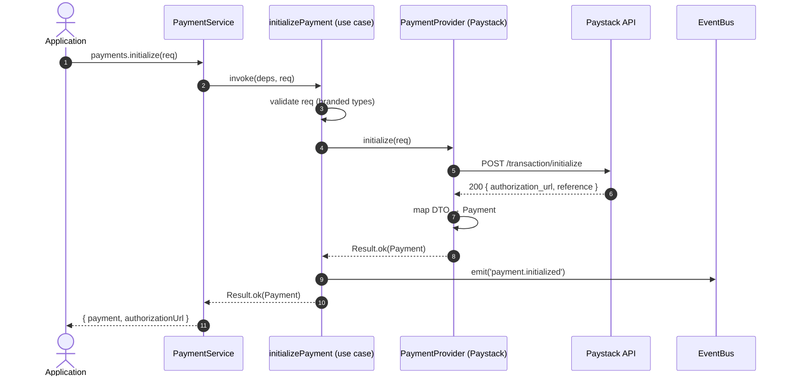
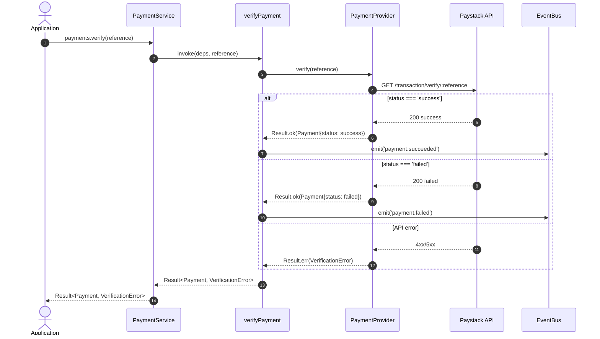
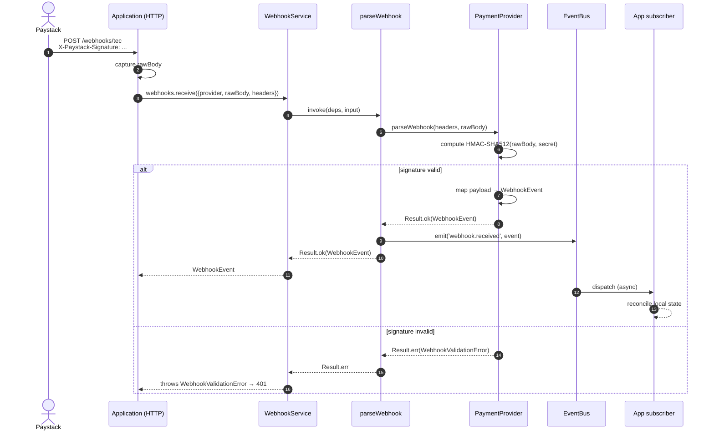
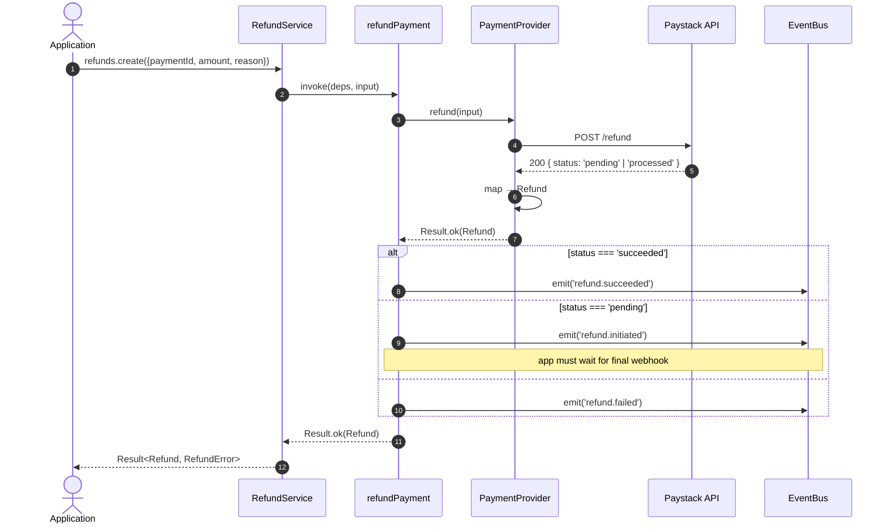
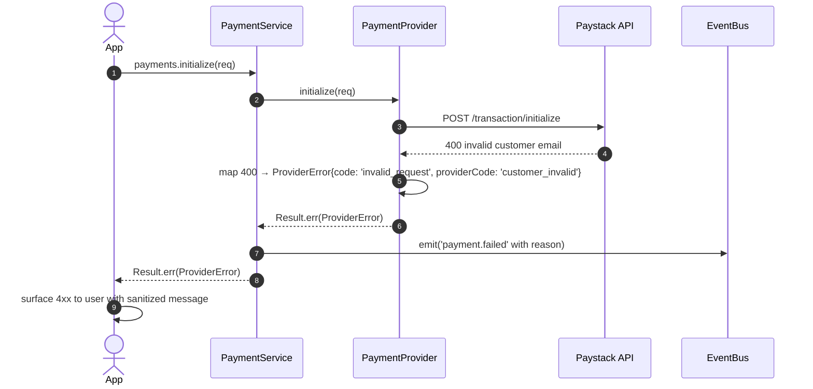
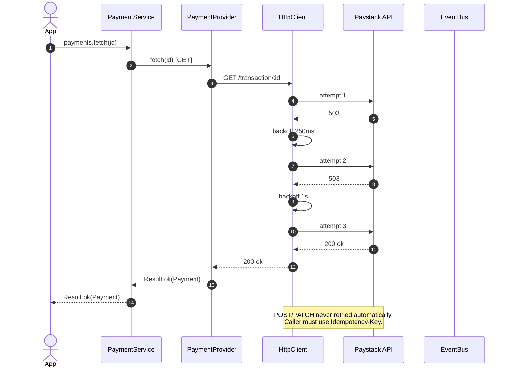

# ADR-0001: @tec/payment — Initial Architecture

> **Status:** REVISION 2 — design-review revisions applied; awaiting founder re-approval.
> **Date:** 2026-07-14 (original); 2026-07-14 (revised)
> **Author:** Principal Software Architect
> **Supersedes:** —
> **Superseded by:** —
> **Target version:** 0.1.0 (initial scaffold)
> **Changelog:**
> - **Rev. 2** — Trimmed v1 scope (no circuit breaker, rate limiter, middleware, stub providers). Money is now a branded integer with a validating factory. Added `ProviderFactory` and registry. Simplified event bus to synchronous fire-and-forget. Added Security, Performance, Concurrency, and API Stability sections. Added phased implementation roadmap. Documented v2 provider package split.

---

## 0. Repository State Observed

```
/home/coollad49/stuffs/current/@tec/payment/
├── AGENTS.md          ← operating manual (read)
├── README.md          ← bun default
├── package.json       ← name="payment", module="index.ts", scripts.check-types
├── tsconfig.json      ← strict, ESNext, bundler resolution, bun types
├── index.ts           ← placeholder
├── bun.lock
├── node_modules/
└── .git/
```

**Observations relevant to architecture:**

1. `package.json` declares `"name": "payment"` — must be renamed to `"@tec/payment"` before publish.
2. `tsconfig.json` is strict, ESM (`"module": "Preserve"`), bundler-style resolution. Excellent foundation; we will keep and extend.
3. Runtime is **Bun** (dev) but the SDK must target **Node 18+** as a minimum runtime and be engine-neutral (no Bun-only APIs in published surface).
4. No build pipeline yet. ADR §19 prescribes the toolchain.
5. No folder structure beyond root files — clean slate.

---

## 1. Context

The Engineers Canvas operates multiple products that will each need to accept payments. Today, none share infrastructure. Each product would otherwise:

- Hand-roll Paystack (and later Flutterwave, OPay, Moniepoint, Stripe) integration code.
- Re-invent webhook verification, idempotency, error mapping, and retry logic.
- Couple itself permanently to one provider's API shape.

`@tec/payment` is the **shared kernel** that prevents that. It is a **framework-agnostic, runtime-agnostic TypeScript SDK** that exposes a single, stable public API to applications and hides every provider behind an adapter.

### 1.1 North-star principles

| # | Principle | Concretely means |
|---|-----------|-----------------|
| 1 | **Provider ignorance** | Applications never import a provider package. |
| 2 | **Open/Closed** | New provider = new adapter only. No app code changes. |
| 3 | **Dependency Inversion** | Domain depends on abstractions; adapters implement them. |
| 4 | **Determinism at the edge** | No silent retries, no hidden side-effects, no global state. |
| 5 | **Explicit > clever** | Every code path is auditable; the SDK never "magically" fixes user input. |
| 6 | **Stateless core** | The SDK does not own a database. State is the application's responsibility; the SDK surfaces events for the app to persist. |
| 7 | **Framework-agnostic** | No `express`, no `next`, no `hono`, no `aws-lambda` types in the public surface. |

---

## 2. Scope & Non-Goals

> **Rev. 2 — trimmed per design review.** v1 is intentionally minimal. Anything in the "Reserved for v2" column is *not* built now, but the architecture is shaped to accept it without breaking changes.

### In scope (v1)

- Initialize, verify, refund, fetch, and list payments.
- Webhook reception, signature validation, and normalized event parsing.
- One first-class provider: **Paystack** (embedded in this package).
- Typed error hierarchy with discriminated `Result<T, E>`.
- Branded `Money`, `PaymentReference`, `Currency`, `Provider` types.
- Structured JSON-line logging via injectable `Logger` port.
- In-process pub/sub event bus (minimal).
- `ProviderFactory` for clean provider construction and test substitution.
- Health check.

### Out of scope for v1 (explicitly NOT built now)

| Feature | Status | Reason |
|---------|--------|--------|
| Circuit breaker | Reserved v2 | YAGNI — re-evaluate when an outage actually happens. |
| Rate limiter | Reserved v2 | Provider-side limits; SDK-side shaping is app's job. |
| Middleware pipeline | Reserved v2 | Use cases already have clear seams; interceptor pattern adds indirection. |
| Pluggable retry policy | Built, **but minimal** | One-shot retry on idempotent GETs only. Pluggable backoff in v2. |
| Stub provider folders (Stripe, Flutterwave, OPay, Moniepoint) | **Removed** | Empty folders rot. Add when a real adapter is started. |
| Persistence adapters | Reserved v2 | SDK is stateless. Apps own their DB. |
| Idempotency store | Reserved v2 | Provider `reference` IS the idempotency key for v1. |
| Subscriptions / recurring | Reserved v2 | Out of v1 product scope. |
| Disputes / chargebacks | Reserved v2 | Out of v1 product scope. |
| Multi-currency FX | Reserved v2 | Out of v1 product scope. |
| Browser bundle | Out permanently | Node + edge runtimes only. |
| Built-in HTTP server | Out permanently | Apps bring their own framework. |

### Future (v2+)

- Subscriptions, invoices, transfers, payouts.
- Separate provider packages: `@tec/payment-paystack`, `@tec/payment-stripe`, etc. (see §18.1).
- Optional persistence adapter (`@tec/payment-drizzle`, `@tec/payment-prisma`).
- Idempotency store adapter.
- Middleware/interceptor pipeline.
- Pluggable retry policy with backoff strategies.
- Parallel event handler execution.
- Circuit breaker, rate limiter (if real outages prove the need).

---

## 3. Architectural Style

**Hexagonal Architecture (Ports & Adapters)** combined with **Domain-Driven Design** tactical patterns (entity, value object, domain service, repository interface, domain event).

### 3.1 Layered view

```
┌────────────────────────────────────────────────────────────┐
│                  APPLICATION CODE                          │
│         (Next.js, NestJS, Hono, Express, Worker)           │
└────────────────────────┬───────────────────────────────────┘
                         │  imports
                         ▼
┌────────────────────────────────────────────────────────────┐
│              @tec/payment  (public API)                    │
│   createPaymentClient(config) → PaymentClient             │
└────────────────────────┬───────────────────────────────────┘
                         │
        ┌────────────────┼─────────────────┐
        ▼                ▼                 ▼
┌──────────────┐  ┌──────────────┐  ┌────────────────────┐
│  Application │  │    Domain    │  │   Infrastructure   │
│    Layer     │◄─┤    Layer     │─►│       Layer        │
│              │  │ (pure TS)    │  │  (HTTP, providers) │
│  Use cases   │  │  Entities    │  │  Adapters, ports   │
│  Orchestr.   │  │  VOs, events │  │  impls             │
└──────────────┘  └──────────────┘  └────────────────────┘
        ▲                ▲                 ▲
        └────────────────┴─────────────────┘
            Dependency Inversion: domain knows no infra
```

### 3.2 Dependency rules (enforced by lint / tsc)

- `domain/` imports **nothing** outside itself.
- `application/` may import `domain/` and shared types.
- `infrastructure/` may import `application/` and `domain/` but never the other way.
- `public-api/` is the only layer that exposes types to the outside world.
- No file outside `infrastructure/providers/*` may `import` an HTTP client, provider SDK, or framework module.

---

## 4. Folder Structure

```
@tec/payment/
├── package.json                       # name: @tec/payment
├── tsconfig.json                      # extends ./tsconfig.base.json
├── tsconfig.base.json                 # base compiler options
├── tsconfig.build.json                # emit build config
├── tsup.config.ts                     # build pipeline (ESM + CJS + .d.ts)
├── vitest.config.ts                   # test runner
├── eslint.config.js                   # lint rules
├── .editorconfig
├── .gitignore
├── .npmignore
├── README.md
├── LICENSE
├── CHANGELOG.md
│
├── src/
│   │
│   ├── public-api/                    # ONLY layer visible to consumers
│   │   ├── index.ts                   # barrel
│   │   ├── client.ts                  # createPaymentClient factory
│   │   ├── types.ts                   # re-exports of stable types
│   │   └── version.ts
│   │
│   ├── domain/                        # PURE — no IO, no framework
│   │   ├── money/
│   │   │   ├── money.ts               # value object
│   │   │   ├── currency.ts
│   │   │   └── money.test.ts
│   │   ├── payment/
│   │   │   ├── payment.ts             # entity
│   │   │   ├── payment-status.ts      # discriminated union / state machine
│   │   │   ├── payment-request.ts     # VO
│   │   │   ├── payment-method.ts
│   │   │   ├── payment-attempt.ts
│   │   │   └── payment.test.ts
│   │   ├── customer/
│   │   │   └── customer.ts
│   │   ├── refund/
│   │   │   ├── refund.ts
│   │   │   └── refund-reason.ts
│   │   ├── provider/
│   │   │   ├── provider.ts            # branded union
│   │   │   └── provider-capability.ts
│   │   ├── metadata/
│   │   │   └── metadata.ts            # branded JSON type
│   │   ├── reference/
│   │   │   └── payment-reference.ts   # branded string
│   │   ├── webhook/
│   │   │   ├── webhook-event.ts
│   │   │   └── webhook-signature.ts
│   │   └── events/
│   │       ├── payment-initialized.ts
│   │       ├── payment-pending.ts
│   │       ├── payment-succeeded.ts
│   │       ├── payment-failed.ts
│   │       ├── refund-initiated.ts
│   │       ├── refund-succeeded.ts
│   │       ├── refund-failed.ts
│   │       ├── webhook-received.ts
│   │       ├── verification-completed.ts
│   │       └── event-base.ts
│   │
│   ├── application/                   # Use cases (orchestration)
│   │   ├── ports/
│   │   │   ├── payment-provider.ts    # provider contract
│   │   │   ├── http-client.ts
│   │   │   ├── logger.ts
│   │   │   ├── clock.ts
│   │   │   ├── id-generator.ts
│   │   │   ├── event-bus.ts
│   │   │   └── webhook-verifier.ts
│   │   ├── use-cases/
│   │   │   ├── initialize-payment.ts
│   │   │   ├── verify-payment.ts
│   │   │   ├── fetch-payment.ts
│   │   │   ├── list-payments.ts
│   │   │   ├── refund-payment.ts
│   │   │   ├── parse-webhook.ts
│   │   │   └── health-check.ts
│   │   ├── services/
│   │   │   ├── payment-service.ts     # façade
│   │   │   ├── refund-service.ts
│   │   │   └── webhook-service.ts
│   │   ├── event-bus/
│   │   │   ├── in-memory-event-bus.ts    # minimal pub/sub (v1)
│   │   │   └── subscription.ts
│   │   └── use-cases/*.test.ts
│   │
│   ├── infrastructure/                # IO, adapters, side-effects
│   │   ├── http/
│   │   │   ├── fetch-http-client.ts   # default impl using fetch
│   │   │   ├── retry-policy.ts
│   │   │   ├── circuit-breaker.ts
│   │   │   └── rate-limiter.ts
│   │   ├── providers/
│   │   │   ├── provider-factory.ts       # constructs the right PaymentProvider
│   │   │   └── paystack/
│   │   │       ├── paystack-adapter.ts
│   │   │       ├── paystack-types.ts
│   │   │       ├── paystack-mapper.ts     # provider DTO → domain
│   │   │       ├── paystack-webhook.ts
│   │   │       └── paystack-adapter.test.ts
│   │   ├── webhook/
│   │   │   └── hmac-webhook-verifier.ts  # default verifier for HMAC-SHA512 providers
│   │   ├── logging/
│   │   │   ├── console-logger.ts
│   │   │   └── noop-logger.ts
│   │   ├── clock/
│   │   │   └── system-clock.ts
│   │   ├── id/
│   │   │   └── ulid-id-generator.ts
│   │   ├── event-bus/
│   │   │   └── in-memory-event-bus.ts    # moved to application/event-bus
│   │   └── http/
│   │       └── fetch-http-client.ts
│   │
│   ├── shared/
│   │   ├── result/
│   │   │   ├── result.ts               # Result<T, E> type
│   │   │   └── result.test.ts
│   │   ├── validation/
│   │   │   ├── validator.ts            # tiny schema port
│   │   │   └── validation-error.ts
│   │   ├── types/
│   │   │   ├── brand.ts
│   │   │   ├── deep-readonly.ts
│   │   │   └── async-iterable.ts
│   │   └── utils/
│   │       ├── invariant.ts
│   │       └── retry.ts
│   │
│   └── errors/
│       ├── payment-error.ts            # base
│       ├── configuration-error.ts
│       ├── provider-unavailable-error.ts
│       ├── webhook-validation-error.ts
│       ├── refund-error.ts
│       ├── network-error.ts
│       ├── timeout-error.ts
│       ├── verification-error.ts
│       ├── validation-error.ts
│       └── error-codes.ts
│
├── tests/
│   ├── integration/
│   │   ├── paystack.spec.ts
│   │   └── webhook-flow.spec.ts
│   ├── fixtures/
│   │   ├── paystack-initialize.json
│   │   └── paystack-webhook.json
│   └── contract/
│       └── provider-contract.spec.ts   # every adapter must pass
│
├── docs/
│   ├── architecture.md                 # this document (compiled)
│   ├── public-api.md
│   ├── extension-guide.md
│   ├── provider-guide.md
│   ├── migration-guide.md
│   ├── versioning.md
│   └── adr/
│       ├── 0001-initial-architecture.md
│       └── template.md
│
└── scripts/
    ├── verify-build.sh
    └── publish-checklist.sh
```

### 4.1 Package organization rationale

- **Feature folders inside each layer** (not "controllers/services/repositories"). Easy to delete, easy to navigate.
- **Provider adapters are isolated** so a single misbehaving adapter cannot pollute the rest of the SDK.
- **`public-api` is a firewall**: any accidental internal export must be moved here to be visible. Forces conscious API design.

---

## 5. Public API

### 5.1 Surface (entrypoint: `@tec/payment`)

```ts
// The ONLY entrypoint. Everything else is internal.
import {
  createPaymentClient,    // factory
  PaymentClient,          // type of returned object
  PaymentError,           // error class
  ConfigurationError,
  WebhookValidationError,
  RefundError,
  // types only
  Payment,
  PaymentRequest,
  PaymentStatus,
  PaymentEvent,
  WebhookEvent,
  Refund,
  Money,
  Currency,
  Provider,
  Metadata,
} from '@tec/payment';
```

**Rule:** `src/public-api/index.ts` is the *only* file that re-exports internals. Every other folder is `internal` by convention; TypeScript path mappings in `tsconfig.json` make them physically unreachable to consumers in published builds.

### 5.2 The `PaymentClient` object

```ts
interface PaymentClient {
  readonly payments: PaymentService;
  readonly refunds: RefundService;
  readonly webhooks: WebhookService;
  readonly events: EventSubscription;
  readonly providers: ProviderRegistry;
  health(): Promise<HealthReport>;
}
```

Each service is a thin façade over use cases. The application code is short and obvious.

### 5.3 Example usage (target shape — illustrative only)

```ts
const tec = createPaymentClient({
  providers: {
    paystack: { secretKey: process.env.PAYSTACK_SECRET! },
  },
  defaultProvider: 'paystack',
  logging: { level: 'info' },
});

// 1. Initialize
const { payment, authorizationUrl } = await tec.payments.initialize({
  amount: { amount: 50_000, currency: 'NGN' }, // 500.00 NGN (minor units)
  customer: { email: 'a@b.com' },
  reference: 'order-9001',
  callbackUrl: 'https://app/verify',
});

// 2. Verify (after redirect)
const verified = await tec.payments.verify('order-9001');

// 3. Webhook
app.post('/webhooks/tec', async (req) => {
  const event = await tec.webhooks.receive({
    provider: 'paystack',
    rawBody: req.rawBody,
    signature: req.headers['x-paystack-signature'],
  });
  // emit normalized event to app
});
```

**Design choices baked in:**

- **No callbacks.** `Promise<Result>` style throughout.
- **Branded primitives** (`amount` is `Money`, not `{ amount: number }`) so app code cannot accidentally pass a float of NGN in major units.
- **`reference` is app-owned.** The SDK never invents one; the app provides it. This makes idempotency controllable.

---

## 6. Internal API

Internal types live in `domain/` and `application/ports/`. They are *not* exported from the public barrel. They are documented for adapter authors only (see `docs/extension-guide.md`).

Internal API categories:

- **Ports** — interfaces in `application/ports/*.ts` (e.g. `PaymentProvider`).
- **Use cases** — pure functions in `application/use-cases/*.ts` (e.g. `initializePayment(deps, input): Promise<Result<...>>`).
- **Domain events** — frozen interfaces in `domain/events/*.ts`.
- **Mappers** — `*-mapper.ts` in each provider folder translate provider DTOs ↔ domain.

---

## 7. Domain Layer

### 7.1 Design rules

1. **No IO.** No `fetch`, no `Date.now()` (use injected `Clock`), no `Math.random()` (use injected `IdGenerator`).
2. **No provider types leak.** A Paystack response shape never appears in `domain/`.
3. **All VOs are immutable** and have structural equality.
4. **All entities carry an `id`, `providerId`, `createdAt`, and `version`** (optimistic concurrency placeholder for v2).

### 7.2 `Money` (value object)

> **Rev. 2 — branded integer + factory** (per design review). The previous draft used `number` directly. This invited the wrong things in (floats, negatives, NaN, strings from JSON parsed at the boundary). The fix is a **branded integer primitive** constructed only through a validating factory.

```ts
// Brand prevents `Money` from accepting a raw `number` from the wild.
type MinorUnits = number & { readonly __brand: 'MinorUnits' };

// The ONLY way to construct MinorUnits. Throws ValidationError on bad input.
function MinorUnits(value: number): MinorUnits {
  if (!Number.isFinite(value))           throw new ValidationError('amount_not_finite', { value });
  if (!Number.isInteger(value))          throw new ValidationError('amount_not_integer', { value });
  if (value < 0)                          throw new ValidationError('amount_negative', { value });
  // 2^53 - 1 = 9_007_199_254_740_991 minor units ≈ $90 trillion.
  if (value > Number.MAX_SAFE_INTEGER)    throw new ValidationError('amount_overflow', { value });
  return value as MinorUnits;
}

interface Money {
  readonly amount: MinorUnits;     // integer, minor units, >= 0 (zero allowed for free trials)
  readonly currency: Currency;      // ISO 4217
}

// Money's factory: never trust the caller.
function Money(input: { amount: number; currency: string }): Money {
  return { amount: MinorUnits(input.amount), currency: Currency(input.currency) };
}
```

**Why integer + factory, not `bigint`?**

- `bigint` breaks `JSON.stringify` without a custom reviver, breaking webhooks and logs.
- We enforce integer at the boundary; the precision range of `number` (2^53) covers any realistic transaction.
- The *real* problem wasn't precision — it was **untrusted values entering the system**. The factory makes that impossible.

**Why minor units?** Floating-point money is a CV-generating machine. Storing in major units would force `Decimal.js` into the public type.

**Why allow zero?** Free trials, 100%-off promo codes, $0 auth holds. Refunds must reject zero.

### 7.3 `Currency`

```ts
type Currency = 'NGN' | 'GHS' | 'ZAR' | 'KES' | 'USD' | 'EUR' | 'GBP' | (string & { __brand: 'Currency' });
```

The `string & { __brand }` intersection allows unknown ISO codes at compile time while preventing accidental non-currency string assignment.

### 7.4 `PaymentRequest` (input VO)

```ts
interface PaymentRequest {
  readonly amount: Money;
  readonly customer: CustomerReference;
  readonly reference: PaymentReference;   // app-supplied, unique per attempt
  readonly callbackUrl?: string;          // for redirect flows
  readonly channels?: ReadonlyArray<PaymentChannel>;
  readonly metadata?: Metadata;
  readonly expiresAt?: Date;              // optional TTL
}
```

### 7.5 `Payment` (entity)

```ts
interface Payment {
  readonly id: PaymentId;                  // provider-issued
  readonly providerId: Provider;
  readonly reference: PaymentReference;    // app-supplied
  readonly amount: Money;
  readonly status: PaymentStatus;
  readonly customer: Customer;
  readonly authorizationUrl?: string;      // redirect URL, when applicable
  readonly channel?: PaymentChannel;
  readonly attempts: ReadonlyArray<PaymentAttempt>;
  readonly metadata: Metadata;
  readonly createdAt: Date;
  readonly updatedAt: Date;
  readonly paidAt?: Date;
  readonly failureReason?: FailureReason;
}
```

### 7.6 `PaymentStatus` (state machine)

```
        ┌─────────────────┐
        │   initialized   │
        └────────┬────────┘
                 │
        ┌────────▼────────┐
        │     pending     │◄─────────┐
        └──┬──────┬───────┘          │
           │      │                  │
   ┌───────▼┐  ┌──▼─────────┐  ┌─────┴──────┐
   │success │  │  failed    │  │ abandoned  │
   └────────┘  └────────────┘  └────────────┘
                 │
            ┌────▼─────┐
            │ refunded │
            └──────────┘
```

Implemented as discriminated union for type-safe pattern matching:

```ts
type PaymentStatus =
  | { kind: 'initialized' }
  | { kind: 'pending' }
  | { kind: 'success'; paidAt: Date }
  | { kind: 'failed'; reason: FailureReason; failedAt: Date }
  | { kind: 'abandoned' }
  | { kind: 'refunded'; refundedAt: Date; refundId: RefundId };
```

**Why discriminated union instead of enum?** Forces the caller to handle every state at compile time, and lets us attach state-specific data (`reason`, `paidAt`).

### 7.7 `PaymentAttempt`

```ts
interface PaymentAttempt {
  readonly id: string;            // provider attempt id
  readonly status: PaymentStatus;
  readonly channel: PaymentChannel;
  readonly ipAddress?: string;
  readonly fees?: Money;
  readonly authorizationCode?: string; // for charging later (recurring v2)
  readonly bin?: string;              // first 6 of card
  readonly last4?: string;
  readonly bank?: string;
  readonly rawResponse: Readonly<Record<string, unknown>>; // provider envelope
  readonly attemptedAt: Date;
}
```

### 7.8 `Customer`

```ts
interface Customer {
  readonly id: string;            // provider customer id
  readonly email: string;
  readonly phone?: string;
  readonly name?: string;
  readonly metadata?: Metadata;
}
```

### 7.9 `CustomerReference` (input)

```ts
type CustomerReference =
  | { kind: 'new'; email: string; phone?: string; name?: string }
  | { kind: 'existing'; providerCustomerId: string }
  | { kind: 'inline'; customer: Customer };
```

### 7.10 `Refund`

```ts
interface Refund {
  readonly id: RefundId;
  readonly paymentId: PaymentId;
  readonly providerId: Provider;
  readonly amount: Money;            // partial or full
  readonly reason: RefundReason;
  readonly status: RefundStatus;
  readonly initiatedAt: Date;
  readonly completedAt?: Date;
  readonly failureReason?: FailureReason;
  readonly metadata?: Metadata;
}

type RefundStatus =
  | { kind: 'pending' }
  | { kind: 'processing' }
  | { kind: 'succeeded'; settledAt: Date }
  | { kind: 'failed'; reason: FailureReason };
```

### 7.11 `Provider`

```ts
type Provider = 'paystack' | 'stripe' | 'flutterwave' | 'opay' | 'moniepoint' | (string & { __brand: 'Provider' });
```

### 7.12 `PaymentReference` (branded)

```ts
type PaymentReference = string & { readonly __brand: 'PaymentReference' };
```

Factory `PaymentReference.of(raw: string)` validates format (alphanumeric + `_-`, length 6-100). Rejects empties, rejects `'reference'` literals that aren't pre-validated.

### 7.13 `Metadata`

```ts
type Metadata = Readonly<Record<string, string | number | boolean | null>>;
```

Strict shape: prevents apps from stuffing nested objects that some providers strip anyway.

### 7.14 `WebhookEvent`

```ts
interface WebhookEvent<TPayload = unknown> {
  readonly id: string;                   // provider event id
  readonly provider: Provider;
  readonly type: WebhookEventType;       // normalized
  readonly originalType: string;         // raw provider type
  readonly createdAt: Date;
  readonly receivedAt: Date;             // SDK receive time
  readonly payload: TPayload;            // normalized, provider-agnostic
  readonly raw: Readonly<Record<string, unknown>>;
}

type WebhookEventType =
  | 'payment.initialized'
  | 'payment.pending'
  | 'payment.succeeded'
  | 'payment.failed'
  | 'refund.initiated'
  | 'refund.succeeded'
  | 'refund.failed'
  | 'unknown';
```

### 7.15 `PaymentEvent` (internal domain event)

```ts
interface PaymentEvent {
  readonly type: PaymentEventType;
  readonly payment: Payment;
  readonly occurredAt: Date;
  readonly correlationId: string;
}

type PaymentEventType =
  | 'payment.initialized' | 'payment.pending'
  | 'payment.succeeded' | 'payment.failed'
  | 'refund.initiated'    | 'refund.succeeded' | 'refund.failed'
  | 'webhook.received'    | 'verification.completed';
```

**Difference between `WebhookEvent` and `PaymentEvent`?**

- `WebhookEvent` is what the SDK emits from a webhook POST. It is the *raw receipt*.
- `PaymentEvent` is what use cases emit internally after successfully applying a webhook's effect (e.g. updating payment status). It is *the resulting domain mutation*.

---

## 8. Application Layer

### 8.1 Use cases — signature convention

Every use case is a pure function with explicit dependencies:

```ts
type UseCase<Input, Output, Deps = unknown> = (
  deps: Deps,
  input: Input
) => Promise<Result<Output, PaymentError>>;
```

`Result<T, E>` is a discriminated union (`{ ok: true; value: T } | { ok: false; error: E }`) — never throw for expected errors. Throw only for programmer errors (invariant violations).

### 8.2 Use case list

| Use case | Purpose | Dependencies |
|----------|---------|--------------|
| `initializePayment` | Create a new payment with the configured provider | `PaymentProvider`, `IdGenerator`, `Clock`, `EventBus` |
| `verifyPayment` | Confirm a payment's status via provider API | `PaymentProvider`, `EventBus` |
| `fetchPayment` | Retrieve a payment by id or reference | `PaymentProvider` |
| `listPayments` | List payments with pagination + filters | `PaymentProvider` |
| `refundPayment` | Initiate a refund (full or partial) | `PaymentProvider`, `EventBus` |
| `parseWebhook` | Verify signature + normalize provider event | `PaymentProvider`, `EventBus` |
| `healthCheck` | Probe provider availability | `PaymentProvider` |

### 8.3 Services (façades)

Services compose use cases and apply the event bus:

```ts
class PaymentService {
  constructor(
    private readonly provider: PaymentProvider,
    private readonly bus: EventBus,
    private readonly clock: Clock,
  ) {}
  initialize(input: PaymentRequest): Promise<Result<Payment, PaymentError>> { /* ... */ }
  verify(reference: PaymentReference): Promise<Result<Payment, VerificationError>> { /* ... */ }
}
```

### 8.4 Ports

`application/ports/` defines the contracts adapters must implement.

```ts
// payment-provider.ts
interface PaymentProvider {
  readonly id: Provider;
  readonly capabilities: ProviderCapabilities;
  initialize(req: PaymentRequest): Promise<Result<Payment, ProviderError>>;
  verify(reference: PaymentReference): Promise<Result<Payment, ProviderError>>;
  fetch(id: PaymentId): Promise<Result<Payment, ProviderError>>;
  list(query: ListQuery): Promise<Result<Page<Payment>, ProviderError>>;
  refund(input: RefundRequest): Promise<Result<Refund, ProviderError>>;
  parseWebhook(headers: Readonly<Record<string, string>>, rawBody: string | Buffer): Promise<Result<WebhookEvent, WebhookValidationError>>;
  health(): Promise<HealthStatus>;
}
```

---

## 9. Infrastructure Layer

> **Rev. 2 — trimmed.** Circuit breaker, rate limiter, and middleware pipeline are **removed for v1**. Retry is reduced to a single, simple rule (idempotent GET only).

### 9.1 HTTP client

`FetchHttpClient` is the default implementation. It wraps native `fetch` (Node 18+, Bun, edge). It enforces:

- Absolute URL construction from a base URL set per provider.
- Timeout via `AbortController` (configurable, default 30s).
- **One** automatic retry for idempotent verbs (GET, HEAD) on 5xx / network errors. No exponential backoff ladder in v1 — fixed 500ms delay. (Pluggable backoff in v2.)
- No retry on POST/PATCH/DELETE.
- Correlation ID header propagation (`X-TEC-Correlation-Id`).

The `HttpClient` port lets apps substitute `undici`, `axios`, or a mock for tests.

**Circuit breaker, rate limiter, retry-with-jitter: explicitly NOT in v1.** When a real outage happens, we'll add them behind the existing `HttpClient` port without changing any consumer.

### 9.2 Provider adapter pattern

```
infrastructure/providers/paystack/
  ├── paystack-adapter.ts         # implements PaymentProvider
  ├── paystack-types.ts           # provider DTOs (NEVER exported)
  ├── paystack-mapper.ts          # DTO → domain
  ├── paystack-webhook.ts         # signature + parse
  └── paystack-adapter.test.ts
```

**Adapter responsibilities:**

- Translate domain request → provider HTTP request.
- Send via injected `HttpClient`.
- Translate provider response → domain `Result<Payment, ProviderError>`.
- Implement webhook signature verification using provider's algorithm.
- Map provider events to normalized `WebhookEventType`.

**Adapter non-responsibilities:**

- Retries (HTTP client does this).
- Logging shape (logger does this).
- Event emission (use case does this).
- State storage (out of scope).

### 9.3 Webhook verification

`infrastructure/webhook/hmac-webhook-verifier.ts` is the default for providers using HMAC-SHA512 (Paystack). Other providers (Stripe uses `Stripe-Signature` with timestamped HMAC) get their own verifier inside their adapter folder.

Signature verification **always** uses the **raw body** bytes — adapters must be told by the application to deliver `req.rawBody`. The public API documents this contract loudly.

### 9.4 Logging

`Logger` port with `ConsoleLogger` (default JSON-line output) and `NoopLogger` (for tests). Levels: `debug | info | warn | error`. Logger never receives secrets; messages are constructed by the SDK with redaction helpers (e.g. `redact({ authorization: '...' })`).

### 9.5 Clock

`Clock` port. `SystemClock` returns `new Date()`. Tests inject a `FixedClock`.

### 9.6 ID generator

`IdGenerator` port. Default `UlidIdGenerator` for internal correlation/event ids. **Not** used to generate payment references (those are app-supplied).

### 9.7 Event bus

> **Rev. 2 — minimal pub/sub.** No queues, no backpressure, no parallel execution. Just `emit` / `on` / `off`.

`InMemoryEventBus` is a tiny synchronous pub/sub. Subscribers are typed:

```ts
bus.on('payment.succeeded', async (event) => { /* fully typed */ });
const off = bus.off; // returns Unsubscribe
```

- **Synchronous dispatch, fire-and-forget.** `emit()` returns after scheduling; it does not await handlers.
- **Errors are caught, logged, and swallowed.** A misbehaving handler cannot break the chain.
- **In-process only.** Multi-process / cross-service eventing is an app concern (use Redis, NATS, etc.).

A v2 may add an `OutboxEventBus` for transactional outbox patterns, but the contract (`on` / `off` / `emit`) stays the same.

---

## 10. Provider Contract — `PaymentProvider`

### 10.1 Why each method exists

| Method | Why |
|--------|-----|
| `initialize(req)` | First half of the lifecycle. Provider returns a `Payment` with `authorizationUrl` (for redirect) or inline data. |
| `verify(reference)` | After redirect, the app asks the provider directly — never trusts the redirect query params. |
| `fetch(id)` | Look up a single payment by provider-assigned id. |
| `list(query)` | Reconciliation, admin dashboards, reconciliation jobs. |
| `refund(input)` | Reverse a successful payment, fully or partially. |
| `parseWebhook(headers, rawBody)` | Validate signature, return normalized event or throw. |
| `health()` | Liveness probe — for `/health` endpoints and orchestrators. |

**Why no `cancel`?** Cancellations are provider-specific (Paystack: not supported for non-pending; Stripe: `PaymentIntent.cancel()`). Cancellation is expressed as "do nothing" — the payment expires naturally. If v2 needs explicit cancel, we add it as an optional capability (`ProviderCapabilities.cancel = true`).

### 10.2 `ProviderCapabilities`

```ts
interface ProviderCapabilities {
  readonly supportsAuthorizationUrl: boolean;
  readonly supportsRecurring: boolean;        // v2
  readonly supportsPartialRefund: boolean;
  readonly supportsWebhooks: boolean;
  readonly maxAmount?: Money;
  readonly supportedCurrencies: ReadonlyArray<Currency>;
  readonly supportedChannels: ReadonlyArray<PaymentChannel>;
}
```

Apps can query `client.providers.get('paystack').capabilities` to render the right UI.

### 10.3 `ProviderFactory` — provider construction, isolated

> **Rev. 2 — added per design review.** The first draft let `createPaymentClient` construct providers inline. That's fine for one provider; it's wrong for the future. Provider construction must be its own component so it's (a) testable, (b) extensible without touching client code, and (c) the single seam where v2 provider packages plug in.

```ts
// application/ports/provider-factory.ts
interface ProviderFactory {
  create(id: Provider, config: ProviderConfig, deps: ProviderDeps): PaymentProvider;
  supported(): ReadonlyArray<Provider>;
}

// internal registry — populated in v1 with paystack; later by package self-registration.
const registry = new Map<Provider, ProviderFactoryEntry>();

export function registerProvider(id: Provider, entry: ProviderFactoryEntry): void;
export function resolveProviderFactory(id: Provider): ProviderFactory;
```

**Why a registry, not a switch statement?**

- A `switch` makes adding providers require editing a closed file. The registry is **open** — a v2 `@tec/payment-stripe` package calls `registerProvider('stripe', ...)` at import time. Core never has to know.
- It keeps `createPaymentClient` ignorant of provider details.
- It makes "what providers are available?" a queryable fact.

**v1 default registration:** Paystack only, registered when the package is imported. v2 packages register themselves.

**Provider dependencies (`ProviderDeps`):** `HttpClient`, `Logger`, `Clock`, `IdGenerator`, `EventBus`, `WebhookVerifier` — the same ports every use case gets. Providers are peers of use cases in the dependency graph.

---

## 11. Sequence Diagrams

### 11.1 Initialize Payment



### 11.2 Verify Payment



### 11.3 Webhook Processing



### 11.4 Refund



### 11.5 Failed Payment



### 11.6 Retry (caller-controlled, automatic for idempotent reads)



---

## 12. Event System

> **Rev. 2 — minimal.** v1 ships a tiny synchronous pub/sub. Async dispatch, parallel execution, and outbox patterns are reserved for v2.

### 12.1 Type taxonomy

| Event | Source | Payload |
|-------|--------|---------|
| `payment.initialized` | use case | `Payment` |
| `payment.pending` | use case / webhook | `Payment` |
| `payment.succeeded` | use case / webhook | `Payment` |
| `payment.failed` | use case / webhook | `Payment` + `FailureReason` |
| `refund.initiated` | use case | `Refund` |
| `refund.succeeded` | use case / webhook | `Refund` |
| `refund.failed` | use case / webhook | `Refund` + `FailureReason` |
| `webhook.received` | webhook use case | `WebhookEvent` |
| `verification.completed` | verify use case | `Payment` |

### 12.2 Bus contract

```ts
interface EventBus {
  emit(type: PaymentEventType, event: PaymentEvent): void;
  on<T extends PaymentEventType>(type: T, handler: Handler<T>): Unsubscribe;
  onAny(handler: (event: PaymentEvent) => void): Unsubscribe;
}

type Unsubscribe = () => void;
```

- **Synchronous dispatch.** `emit()` schedules handlers and returns immediately. It does **not** `await` them.
- **Errors are caught, logged, swallowed.** A misbehaving handler cannot break the chain.
- **In-process only.** Multi-process / cross-service eventing is an app concern.
- **No backpressure, no queues, no parallel fan-out** in v1. Add `OutboxEventBus` / `ParallelEventBus` in v2 without changing this signature.

### 12.3 Why an event system (even a tiny one)?

- Apps need to **react** to payment state changes (send email, update DB, notify Slack).
- Without a bus, apps duplicate "what to do when X happens" in every webhook handler and refund flow.
- The bus is the seam where the SDK's *technical* events become the *application's* business events. A 30-line pub/sub is enough to start.

### 12.4 What v1 deliberately does NOT do

| Feature | Status | When added |
|---------|--------|------------|
| Async / awaited handlers | Out | v2 — if a real consumer needs backpressure. |
| Parallel fan-out | Out | v2 — if a real consumer has slow handlers. |
| Outbox / transactional events | Out | v2 — when a persistence adapter appears. |
| Cross-process bus (Redis/NATS) | Out | App concern. SDK is single-process. |

---

## 13. Error Hierarchy

### 13.1 Class diagram

```
PaymentError (abstract, extends Error)
├── ConfigurationError           # bad config at createPaymentClient()
├── ValidationError              # bad input from app
├── ProviderUnavailableError     # provider down or unreachable
├── NetworkError                 # HTTP failure, DNS, TLS
├── TimeoutError                 # AbortController fired
├── WebhookValidationError       # signature mismatch, malformed body
├── VerificationError            # verify() couldn't confirm state
├── RefundError                  # refund rejected by provider
├── ProviderError                # generic provider 4xx/5xx with providerCode
│   ├── ProviderBadRequestError
│   ├── ProviderUnauthorizedError
│   ├── ProviderNotFoundError
│   ├── ProviderConflictError
│   └── ProviderRateLimitError
└── InternalError                # SDK bug; should never happen
```

### 13.2 Shape

```ts
abstract class PaymentError extends Error {
  abstract readonly code: ErrorCode;
  abstract readonly category: ErrorCategory;
  readonly cause?: unknown;
  readonly provider?: Provider;
  readonly providerCode?: string;
  readonly correlationId: string;
  readonly isRetryable: boolean;
  readonly httpStatus: number;        // suggested response status
  readonly meta?: Readonly<Record<string, unknown>>;
}

type ErrorCategory =
  | 'configuration' | 'validation'
  | 'provider' | 'network' | 'timeout'
  | 'webhook' | 'refund' | 'verification'
  | 'internal';
```

### 13.3 When each is thrown

| Error | When |
|-------|------|
| `ConfigurationError` | Missing secret, unknown provider, conflicting options. Thrown at `createPaymentClient()`. |
| `ValidationError` | Bad request shape (e.g. negative amount, empty reference). Returned as `Result.err`. |
| `NetworkError` | DNS failure, TCP reset, TLS error. Returned as `Result.err`, `isRetryable: true`. |
| `TimeoutError` | Provider exceeded `timeoutMs`. Returned as `Result.err`, `isRetryable: true`. |
| `ProviderUnavailableError` | 5xx after all retries. Returned as `Result.err`, `isRetryable: true`. |
| `ProviderError` | 4xx with provider's error message. Returned as `Result.err`, `isRetryable: false` (except 429). |
| `ProviderRateLimitError` | 429. Returned as `Result.err`, `isRetryable: true`. |
| `WebhookValidationError` | Bad signature, expired timestamp, malformed body. **Thrown** (not Result) — apps should respond 401/400. |
| `VerificationError` | Provider API call to verify failed. Returned as `Result.err`. |
| `RefundError` | Refund rejected. Returned as `Result.err`. |
| `InternalError` | SDK invariant broken. Thrown. Should open a bug report. |

### 13.4 Why `Result` for some, `throw` for others?

- **Result** for *expected* failures (provider rejected the request). Apps must handle these as data.
- **throw** for *unexpected* / *unrecoverable* (bad config, SDK bug, signature invalid). Throwing is the right signal: caller should crash, not silently continue.

---

## 14. Configuration System

### 14.1 `createPaymentClient(config)` shape

```ts
interface PaymentClientConfig {
  readonly providers: ProviderConfigs;       // keyed by Provider
  readonly defaultProvider?: Provider;       // used when call doesn't specify
  readonly logging?: LoggingConfig;
  readonly http?: HttpClientConfig;
  readonly retry?: RetryConfig;
  readonly eventBus?: EventBus;              // inject custom bus
  readonly clock?: Clock;                    // inject for tests
  readonly idGenerator?: IdGenerator;        // inject for tests
  readonly logger?: Logger;                  // inject custom logger
  readonly httpClient?: HttpClient;          // inject custom HTTP impl
  readonly middleware?: ReadonlyArray<Middleware>; // request/response interceptors
}

type ProviderConfigs = {
  readonly [K in Provider]?: ProviderConfig;
};

interface ProviderConfig {
  readonly secretKey: string;
  readonly publicKey?: string;
  readonly webhookSecret?: string;
  readonly baseUrl?: string;          // override for sandbox
  readonly timeoutMs?: number;        // default 30_000
  readonly enabled?: boolean;         // default true
  readonly options?: Readonly<Record<string, unknown>>; // provider-specific
}
```

### 14.2 Configuration resolution order

1. Caller-supplied value (DI / explicit).
2. Default value from SDK.
3. **Error** if neither.

Configuration is **immutable after construction**. To change a secret, build a new client.

### 14.3 Environment variable support

`createPaymentClient.fromEnv()` factory reads:

```
TEC_PAYMENT_DEFAULT_PROVIDER=paystack
TEC_PAYMENT_LOGGING_LEVEL=info
TEC_PAYMENT_PAYSTACK_SECRET_KEY=sk_...
TEC_PAYMENT_PAYSTACK_WEBHOOK_SECRET=...
TEC_PAYMENT_STRIPE_SECRET_KEY=sk_...
```

This is a **thin convenience wrapper**, not a magic layer. The plain `createPaymentClient()` API is the canonical one.

### 14.4 Multi-provider selection at call site

```ts
await tec.payments.initialize(req);                          // uses defaultProvider
await tec.payments.initialize(req, { provider: 'stripe' });  // explicit
await tec.providers.get('paystack').capabilities;            // introspect
```

---

## 15. Validation Strategy

### 15.1 Approach: lightweight, schema-agnostic

The SDK does **not** depend on Zod / Valibot / ArkType in its public surface. Instead:

- A `Validator<T>` port is defined in `application/ports/`.
- Default impl is a hand-rolled validator built on `shared/validation/`.
- Adapters may *additionally* use Zod internally for parsing provider responses — that's fine because it's inside `infrastructure/`.

### 15.2 Why no Zod by default?

- Avoids 50KB+ bundle hit for the smallest consumers.
- Keeps the SDK dependency tree minimal (Stripe SDK's own tree is famously thin).
- Public API types already express the contract; runtime validation is for boundary objects (provider responses, raw webhook bodies) only.

### 15.3 What gets validated where

| Boundary | Validator |
|----------|-----------|
| App → SDK (request inputs) | Branded types + light checks at service boundary |
| SDK → Provider (HTTP body) | Hand-rolled schema in adapter |
| Provider → SDK (HTTP response) | Hand-rolled schema in adapter (`parsePaystackResponse()`) |
| Provider → SDK (webhook body) | Same, plus HMAC verification |

### 15.4 Optional strict mode

`createPaymentClient({ validation: 'strict' })` enables deeper runtime checks (email format, ISO 3166 country, URL parse). Default is `'standard'`.

---

## 16. Logging Strategy

### 16.1 `Logger` port

```ts
interface Logger {
  debug(message: string, context?: LogContext): void;
  info(message: string, context?: LogContext): void;
  warn(message: string, context?: LogContext): void;
  error(message: string, error?: unknown, context?: LogContext): void;
  child(bindings: LogContext): Logger;
}

type LogContext = Readonly<Record<string, string | number | boolean>>;
```

### 16.2 Default — `ConsoleLogger`

- JSON-line output (one event per line) for ingestion by Datadog/Loki/CloudWatch.
- ISO 8601 timestamps.
- Auto-bound: `provider`, `correlationId`, `operation`, `reference` when present.
- Sensitive fields auto-redacted: `authorization`, `secret`, `password`, `signature`, `card`.

### 16.3 `NoopLogger`

For tests, CI noise reduction.

### 16.4 What the SDK logs

- **info**: lifecycle events (`payment.initialized`, `webhook.received`).
- **debug**: full request/response (with redaction) at `level: 'debug'`.
- **warn**: retries, 4xx (non-fatal).
- **error**: 5xx, signature failures, internal errors.

### 16.5 What the SDK never logs

- Raw card numbers, CVV, PINs.
- Full secret keys (only the last 4 chars or a hash).
- Raw request/response bodies when `level: 'info'`.

---

## 17. Testing Strategy

### 17.1 Three-tier pyramid

```
                ┌──────────────┐
                │  Contract    │   ← every adapter passes the same suite
                │   tests      │
                └──────┬───────┘
                       │
              ┌────────▼─────────┐
              │   Integration    │   ← against provider sandbox
              │     tests        │
              └────────┬─────────┘
                       │
         ┌─────────────▼──────────────┐
         │       Unit tests           │   ← domain, use cases, ports
         └────────────────────────────┘
```

### 17.2 Test tooling

- **Runner:** `vitest` (Bun-compatible, fast, ESM-native, excellent TS).
- **Mocking:** built-in `vi.fn()` + `vi.spyOn()`; no `sinon`/`nock`.
- **HTTP mocking:** `msw` (Mock Service Worker) for adapter tests — it speaks fetch natively.
- **Coverage:** `vitest --coverage` with v8 provider; target ≥ 90% on `domain/`, ≥ 80% overall.

### 17.3 Contract test (`tests/contract/provider-contract.spec.ts`)

A single test suite that **every** provider adapter must pass. It verifies:

- `initialize` happy path produces a `Payment` with `authorizationUrl`.
- `initialize` with invalid amount returns `ValidationError`.
- `verify` for a known reference returns the right status.
- `fetch` returns the same `Payment` after `initialize`.
- `refund` of a successful payment returns a `Refund` with `succeeded` status.
- `parseWebhook` rejects bad signatures.
- `parseWebhook` returns a normalized `WebhookEvent` for a known fixture.
- `health` returns a structured `HealthStatus`.

This suite is the *objective definition* of "a working provider".

### 17.4 Fixtures

Real provider payloads (anonymized) committed to `tests/fixtures/`. Updating a fixture is a code review event — it means a provider changed shape.

### 17.5 What is NOT unit-tested

- Third-party HTTP behavior (covered by `msw`).
- Provider sandbox behavior (covered by integration tests against the real sandbox).
- `ConsoleLogger` formatting (covered by a single snapshot test).

---

## 18. Extension Strategy

### 18.1 Adding a new provider

> **Rev. 2 — v2 will split providers into separate npm packages.** v1 keeps Paystack inside `@tec/payment` because shipping two packages now is overhead for one consumer. The split is a packaging change only — the runtime architecture already supports it.

#### v1 (single package)

```
src/infrastructure/providers/<name>/
  ├── <name>-adapter.ts
  ├── <name>-types.ts
  ├── <name>-mapper.ts
  ├── <name>-webhook.ts
  └── <name>-adapter.test.ts
```

Then:

1. Register the provider in the `ProviderFactory` registry (see §10.3).
2. Add the literal to the `Provider` branded type.
3. Add the `TEC_PAYMENT_<NAME>_SECRET_KEY` env var to `fromEnv()`.
4. The contract test (`tests/contract/provider-contract.spec.ts`) automatically exercises it.

**Zero changes to:** `domain/`, `application/`, `public-api/`, or any application code.

#### v2 (separate packages)

```
packages/
  payment/                       # @tec/payment           (core)
  payment-paystack/              # @tec/payment-paystack  (provider)
  payment-stripe/                # @tec/payment-stripe    (provider, future)
  payment-flutterwave/           # @tec/payment-flutterwave (provider, future)
```

Each provider package:

- Depends on `@tec/payment` as a peer.
- Self-registers on import: `import '@tec/payment-paystack'; // calls registerProvider(...)`.
- Has its own version cadence — Paystack API changes don't force a `@tec/payment` release.
- Carries its own integration tests against the real sandbox.

**Migration path:** v1.0 ships Paystack embedded. v1.1 moves Paystack to `@tec/payment-paystack`. The re-export from `@tec/payment` is kept for one major cycle, then removed. The contract test moves with the provider.

### 18.2 Adding a new use case

1. Add use case file to `application/use-cases/`.
2. Add method to the appropriate `*Service` in `application/services/`.
3. Re-export from `public-api/types.ts` if the return type should be public.
4. Add unit tests + integration test.

### 18.3 Adding a new event

1. Add event type to `domain/events/`.
2. Add to `PaymentEventType` union.
3. Emit from the use case.
4. Document in `docs/public-api.md`.

### 18.4 Adding a new error

1. Add class in `errors/`.
2. Extend `ErrorCategory` and `ErrorCode` unions.
3. Throw from the appropriate port / use case.

---

## 19. Build & Distribution

### 19.1 Toolchain

- **Build:** `tsup` (zero-config ESM + CJS + `.d.ts` from a single source).
- **Test:** `vitest`.
- **Lint:** `eslint` (flat config) + `@typescript-eslint` strict + `eslint-plugin-boundaries` (enforces the layer rules in §3.2).
- **Format:** `prettier`.
- **Package manager:** `bun` for dev, `pnpm` or `npm` for consumer install (declare `peerDependencies` carefully).

### 19.2 Build outputs

```
dist/
  index.js          # ESM
  index.cjs         # CJS
  index.d.ts        # types
  index.js.map
  index.cjs.map
  index.d.ts.map
```

`package.json` exports field:

```json
{
  "name": "@tec/payment",
  "version": "0.1.0",
  "type": "module",
  "main": "./dist/index.cjs",
  "module": "./dist/index.js",
  "types": "./dist/index.d.ts",
  "exports": {
    ".": {
      "types": "./dist/index.d.ts",
      "import": "./dist/index.js",
      "require": "./dist/index.cjs"
    }
  },
  "files": ["dist", "README.md", "LICENSE"],
  "engines": { "node": ">=18" }
}
```

### 19.3 TypeScript configuration split

- `tsconfig.base.json` — strict, ES2022 target, ESM, all strict flags.
- `tsconfig.json` — extends base, for IDE / `bun run check-types`.
- `tsconfig.build.json` — extends base, sets `noEmit: false`, used by tsup.

---

## 20. Versioning Strategy

### 20.1 Semver commitment

- **MAJOR** for any breaking change to `public-api/`.
- **MINOR** for new features (new provider, new use case) in a backward-compatible way.
- **PATCH** for bug fixes that do not change the public type surface.

### 20.2 What counts as "breaking"

- Removing or renaming a public export.
- Changing a public type's shape (adding an optional property is NOT breaking).
- Changing `Result` semantics (e.g. swapping `ok` to `success`).
- Changing an error's class hierarchy in a way callers switch on.
- Changing a default config value that would change runtime behavior of existing apps.

### 20.3 What is NOT breaking

- Adding a new provider.
- Adding a new method to a service.
- Adding a new event type.
- Adding a new error subclass.
- Adding an optional field to an existing type.
- Bumping internal dependencies.

### 20.4 Pre-1.0 policy

Versions `0.x.y` may include breaking changes between MINORs. Lock the version tightly in app `package.json` until `1.0.0`.

---

## 21. Migration Strategy

There is no v0 to migrate from. This ADR defines the initial architecture. Future migrations:

- **v1 → v2:** All v1 types must continue to type-check. A `v2/` sub-namespace may be added (`createPaymentClientV2`) for breaking changes during the v2 prerelease. v1 is deprecated but functional for at least 6 months.
- **Provider swap:** Apps change `defaultProvider` only. Zero code changes anywhere else. This is the central promise of `@tec/payment`.
- **Adapter upgrade:** New provider versions are released as `0.x.y` patch bumps. Mapper changes are isolated to the adapter folder.

---

## 22. Documentation Plan

> **Rev. 2 — expanded per design review.** Missing security, performance, concurrency, and stability docs are now first-class deliverables, not afterthoughts.

| File | Audience | Contents |
|------|----------|----------|
| `docs/architecture.md` | Architects, new contributors | This ADR (compiled) |
| `docs/public-api.md` | Application devs | Every export, with examples |
| `docs/extension-guide.md` | Adapter authors | How to add a new provider |
| `docs/provider-guide.md` | Adapter authors | Per-provider quirks (Paystack sandbox keys, Stripe API version pinning, etc.) |
| `docs/migration-guide.md` | App devs | v0→v1, v1→v2, provider-swap recipes |
| `docs/versioning.md` | Contributors | Semver policy, deprecation process |
| `docs/security.md` | All | Threat model, secret handling, webhook verification, replay defense (§26) |
| `docs/performance.md` | Capacity planners | Latency budgets, memory profile, bundle size (§27) |
| `docs/concurrency.md` | App devs | Concurrency model, hazards, multi-client usage (§28) |
| `docs/api-stability.md` | Integrators | What "stable" means, deprecation process (§29) |
| `docs/adr/0001-initial-architecture.md` | All | This document (source) |
| `docs/adr/template.md` | Contributors | Template for new ADRs |
| `README.md` | Everyone | Quickstart, install, basic example |
| `CHANGELOG.md` | All | Conventional-commits-generated |

---

## 23. Resolved Decisions

> **Rev. 2 — decisions are now locked.** Adopted from the open-questions list in the previous revision, resolved in light of the design review.

| # | Decision | Choice | Rationale |
|---|----------|--------|-----------|
| 23.1 | HTTP client | **Pluggable port, `fetch` default** | Apps on edge keep `fetch`; Node apps can inject `undici` for throughput. |
| 23.2 | Validation library | **Hand-rolled, no public dep** | Smallest install footprint. A `Validator` port lets apps bring Zod if they want. |
| 23.3 | Event bus | **Synchronous, in-process, fire-and-forget** | Smallest correct pub/sub. Failure isolation via try/catch. |
| 23.4 | Idempotency | **Caller-owned `reference`; no store in v1** | Paystack/Flutterwave/OPay/Stripe all key on `reference` already. |
| 23.5 | Persistence | **Stateless SDK** | Apps own their DB. Repository port reserved for v2. |
| 23.6 | Build pipeline | **`tsup`** | Zero-config ESM + CJS + dts. Industry standard for SDKs. |
| 23.7 | Test runner | **`vitest`** | ESM-native, runs under Bun and Node, `msw` works seamlessly. |
| 23.8 | Provider packaging | **Embedded in v1; separate packages in v2** | Ship one now; split when a second provider is real. |
| 23.9 | Retry policy | **One fixed 500ms retry on idempotent GETs only** | Simple, predictable. Pluggable backoff in v2. |
| 23.10 | Stub provider folders | **None** | Empty folders rot. Add when a real adapter is started. |

---

## 24. Definition of Done for ADR-0001

> **Rev. 2 — checklist reflects revised scope.**

This ADR is **approved** when:

- [ ] Founder confirms trimmed v1 scope (§2).
- [ ] Founder accepts resolved decisions (§23).
- [ ] Folder structure (§4) is accepted — including no stub provider folders.
- [ ] `Money` + `MinorUnits` factory design (§7.2) is accepted.
- [ ] `ProviderFactory` + registry design (§10.3) is accepted.
- [ ] Minimal event bus (§12) is accepted.
- [ ] v2 package-split migration plan (§18.1) is accepted.
- [ ] Security, performance, concurrency, stability docs (§26–§29) are accepted.
- [ ] Phased implementation roadmap (§25) is accepted.

Once approved, this document becomes the **immutable blueprint**. Any deviation during implementation must produce a new ADR.

---

## 25. Phased Implementation Roadmap

> **Rev. 2 — phased per design review.** Each phase ships a usable artifact, not a half-built library. A phase is "done" only when its acceptance criteria pass and the docs are updated.

### Phase 1 — Skeleton & invariants *(target: 1–2 days)*

**Build:**
- Folder structure (full §4 layout).
- `package.json` renamed to `@tec/payment`; engines pinned to `node >= 18`.
- `tsup.config.ts`, `vitest.config.ts`, `eslint.config.js` with `eslint-plugin-boundaries` enforcing §3.2 layer rules.
- `domain/money/` with `Money`, `MinorUnits`, `Currency`, factory.
- `domain/reference/payment-reference.ts` with factory.
- `domain/provider/provider.ts` branded type.
- `shared/result/result.ts`.
- `errors/` full hierarchy (all classes, no logic yet).
- `public-api/index.ts` exporting only the types and error classes.

**Acceptance:** `bun run check-types` passes. `vitest` runs the empty suite. Importing `@tec/payment` is a no-op (no side effects on import).

### Phase 2 — Paystack end-to-end *(target: 1 week)*

**Build:**
- `application/ports/payment-provider.ts`, `http-client.ts`, `logger.ts`, `clock.ts`, `id-generator.ts`, `event-bus.ts`, `webhook-verifier.ts`, `provider-factory.ts`.
- `application/use-cases/`: `initializePayment`, `verifyPayment`, `fetchPayment`, `listPayments`.
- `application/services/payment-service.ts` façade.
- `infrastructure/http/fetch-http-client.ts` (one fixed 500ms retry on idempotent GETs).
- `infrastructure/logging/{console-logger,noop-logger}.ts`.
- `infrastructure/clock/system-clock.ts`, `infrastructure/id/ulid-id-generator.ts`.
- `infrastructure/event-bus/in-memory-event-bus.ts`.
- `infrastructure/providers/paystack/` (full adapter, mapper, webhook verifier).
- `public-api/createPaymentClient.ts` (factory, `fromEnv` convenience).
- `tests/contract/provider-contract.spec.ts` against Paystack fixtures.
- `tests/integration/paystack.spec.ts` against Paystack sandbox (skipped if no key).

**Acceptance:** All seven use cases work against Paystack sandbox. Contract test green. ≥ 80% coverage on `domain/` and `application/`. The admission portal can be wired up against this version.

### Phase 3 — Webhooks, verification, refunds *(target: 3–4 days)*

**Build:**
- `application/use-cases/{parse-webhook,refund-payment}.ts`.
- `application/services/{refund-service,webhook-service}.ts`.
- Webhook raw-body contract documented in `public-api/`.
- `docs/security.md` (see §26).
- `docs/public-api.md` with full examples.
- Sample Next.js / Hono / Express integration snippets in `docs/integrations/`.

**Acceptance:** An end-to-end test posts a real-looking webhook to a small test server, signature is validated, and the resulting `payment.succeeded` event reaches a test handler. Refund happy path is green.

### Phase 4 — Playground, docs, polish *(target: 3–5 days)*

**Build:**
- `examples/` directory with one minimal runnable per framework (Next.js, Hono, Express).
- `docs/architecture.md` (this file, rendered).
- `docs/extension-guide.md`.
- `docs/provider-guide.md`.
- `docs/migration-guide.md` (initial: how to swap providers later).
- `docs/versioning.md`.
- `docs/security.md`, `docs/performance.md`, `docs/concurrency.md`, `docs/api-stability.md`.
- CHANGELOG with conventional commits since day 1.
- Cut `0.1.0` release.

**Acceptance:** `npm pack` produces a clean tarball. README quickstart works on a fresh clone. Docs answer 8/10 questions a new adapter author would have.

### Phase 5+ (post-v1, never in parallel with v1)

- `0.2.0` — Pluggable retry, idempotency store, second provider.
- `0.3.0` — Provider package split (`@tec/payment-paystack`).
- `1.0.0` — API freeze, full SemVer commitment begins.
- `1.x` — Subscriptions, transfers, persistence adapters, middleware pipeline.

---

## 26. Security Considerations

> **Added per design review.** A payment SDK is a security-critical dependency. This section enumerates the threats and the SDK's defenses so adapter authors and application teams know what is — and is not — the SDK's responsibility.

### 26.1 Secret management

- **Threat:** Secret keys leaked via logs, error messages, or accidental serialization.
- **Defense:**
  - `Logger` port auto-redacts keys whose names match `secret|authorization|password|signature|api[_-]?key|card|pan|cvv` (case-insensitive).
  - Error messages from the SDK never echo raw secrets. `ProviderError.providerCode` carries only the provider's own error code, not its message body, when the message might echo input.
  - Secrets are read from configuration at construction time. They are not accepted as method arguments.
  - `package.json` declares `secretKey` as `string`; the README and type JSDoc warn to read from `process.env` or a secret manager.
- **Not the SDK's job:** key rotation, secret storage, KMS integration. Apps bring their own.

### 26.2 Webhook verification

- **Threat:** Forged webhooks that trigger state changes (e.g. marking an unpaid order as paid).
- **Defense:**
  - Signature is verified against the **raw request body** — never against a re-serialized JSON. The public API requires `rawBody: string | Buffer`.
  - HMAC comparison is **constant-time** (`crypto.timingSafeEqual`) to prevent timing attacks.
  - The signature is checked **before** the body is parsed. A bad signature returns 401 with no body.
  - Webhook timestamps (when the provider includes them — e.g. Stripe's `t=`) are rejected if they drift more than 5 minutes from `Clock.now()`. This prevents replay attacks.
  - Provider event `id` is exposed in the parsed `WebhookEvent.id` so apps can dedupe replays at the application layer.
- **Not the SDK's job:** storing event ids to dedupe across processes. The SDK emits the id; the app persists and checks.

### 26.3 Replay attack prevention (initialize)

- **Threat:** An attacker re-submits an `initialize` request with a captured body, double-charging the user.
- **Defense:** The `reference` is app-supplied and unique-per-attempt. Paystack/Flutterwave/OPay/Stripe all reject duplicate references at the provider side. v1 documents this contract loudly; v2 may add a `reference` uniqueness pre-check via an injected store.
- **App's job:** generate references that are globally unique and unpredictable enough (e.g. `ULID`, not `order-1`).

### 26.4 Sensitive data in errors

- **Threat:** Stack traces, raw provider responses, or partial card numbers exposed to end users.
- **Defense:**
  - All `PaymentError` subclasses are safe to return to a logged-in user with their `httpStatus` as the response code and `message` as a short, generic string. The full details live in `meta` and the underlying `cause`.
  - `internalError` (SDK bug) returns a `correlationId` only. The original error is logged but not exposed.
  - `rawResponse` inside `PaymentAttempt` is exposed for debugging but flagged `internal: true` in the type's JSDoc. Apps must not serialize it to end users.

### 26.5 Transport security

- **Threat:** MITM, downgrade.
- **Defense:** All provider HTTP traffic is HTTPS-only. The `HttpClient` rejects `http://` URLs at the boundary. Certificate validation is delegated to Node/Bun (no custom CA bundle handling in v1).

### 26.6 Dependency hygiene

- **Threat:** Supply chain attack via a transitive dep.
- **Defense:**
  - v1 runtime dependencies: **zero** (uses only Node built-ins: `crypto`, `fetch`, `URL`, `AbortController`).
  - `npm audit` is part of CI. A failing audit is a release blocker.
  - `pnpm-lock.yaml` / `bun.lock` is committed; `npm ci` reproducible installs.
  - `package.json` declares `engines: { node: ">=18" }` to avoid surprises on EOL Node.

### 26.7 What the SDK does NOT defend against

| Threat | Why out of scope | Mitigation owner |
|--------|------------------|------------------|
| Compromised app server | SDK cannot defend a host that's already lost. | App / infra. |
| Provider-side breach | Out of our control. | App monitors `webhook.received` vs `payment.succeeded` mismatches. |
| SSRF via webhook URL config | App does not configure webhook URLs. | n/a in v1. |
| Replay across processes | SDK is single-process. | App persists `webhook.id`. |
| Phishing of customer | Not a system threat. | UX / education. |

---

## 27. Performance Characteristics

> **Added per design review.** Apps need to know what they're getting. This section documents the *measured-or-projected* cost of common operations so capacity planning is possible without running a benchmark.

### 27.1 Latency budget (per call, Paystack)

| Operation | Cold start | Warm | Notes |
|-----------|-----------:|-----:|-------|
| `payments.initialize` | ~5ms SDK overhead + 1 RTT | ~1ms SDK + 1 RTT | Paystack RTT is the dominant term (~200–500ms in-region). |
| `payments.verify` | ~3ms + 1 RTT | ~1ms + 1 RTT | |
| `payments.fetch` | ~2ms + 1 RTT | ~1ms + 1 RTT | |
| `refunds.create` | ~5ms + 1 RTT | ~1ms + 1 RTT | |
| `webhooks.receive` | ~0.5ms (no I/O) | ~0.1ms | Pure CPU: HMAC + parse. |

SDK overhead is dwarfed by provider RTT. Optimizing SDK internals below 1ms is not a v1 priority.

### 27.2 Memory

- **Zero retained state per call** beyond the returned `Payment` / `Refund` / `WebhookEvent`. After the promise resolves, the SDK holds no references.
- **Event handlers** registered on the bus are retained for the lifetime of the client. Each handler is one closure + one map entry. A thousand handlers ≈ 200KB.
- **HTTP client** has no connection pool of its own in v1; we use the platform's `fetch` defaults (Node 18+ has keep-alive by default; Bun does too).

### 27.3 Concurrency

- All public methods are safe to call concurrently. There is no shared mutable state in the SDK.
- The event bus dispatches in registration order; a slow handler delays subsequent handlers. (See §28.)

### 27.4 Bundle size

- v1 ships **zero runtime dependencies**. The published tarball is < 30 KB minified, < 10 KB gzipped (target).
- Type definitions add ~15 KB to a consumer's `node_modules/@types` but do not affect runtime.

### 27.5 What is NOT optimized in v1

- Cold start (we don't tree-shake unused providers yet — only one exists).
- Webhook parsing throughput (we don't need to; webhooks are 1/sec at most).
- Memory pooling for high-throughput servers. If we hit 1k payments/sec we'll revisit; for v1 we don't.

---

## 28. Concurrency Model

> **Added per design review.** Apps need a clear mental model of what is safe to do in parallel.

### 28.1 Guarantees

- **Stateless core.** Every public method is a pure function of its arguments + injected dependencies. There is no module-level mutable state in `domain/` or `application/`.
- **Safe concurrent use.** Two concurrent `initialize` calls with different references produce two independent `Payment` objects. No internal lock is needed.
- **Event bus is single-threaded.** Because Node is single-threaded, `emit()` is atomic with respect to handler registration. A handler that calls `bus.on()` mid-dispatch will only see its handler on the *next* event, not the current one. This is the same model as Node's `EventEmitter`.

### 28.2 Hazards and rules

| Hazard | Rule |
|--------|------|
| Mutating a returned `Payment` | All entities are `Readonly<...>` at the type level. The runtime does not deep-freeze in v1; treat them as immutable by convention. |
| Calling `bus.on()` from inside a handler | Allowed. The new handler does not fire for the in-flight event. |
| Calling `bus.emit()` from inside a handler | Allowed. The new event is queued and dispatched **after** the current handler returns (synchronous recursion guard). |
| Re-entrancy via `await` inside a handler | Handlers are `async`. `emit()` does not await them. So `emit()` returns before any handler runs. A handler can `await` anything; nothing in the SDK depends on handler completion. |
| Multiple clients | Apps may construct multiple `PaymentClient` instances (e.g. one per tenant). Each has its own bus, logger, providers. No global registry in v1. |

### 28.3 What v1 does NOT provide

- **Cross-process events.** If you run multiple Node processes, the in-memory bus is per-process. Use Redis/NATS at the app level.
- **Transactional outbox.** "Emit event AND write to DB atomically" is an app concern. v2 may add an `OutboxEventBus` that writes to a queue table inside the same transaction as the DB write.
- **Handler backpressure.** A slow handler blocks subsequent handlers on the same event. v2 will add bounded concurrency or a `setImmediate`-based fan-out.

---

## 29. API Stability Guarantees

> **Added per design review.** "Stable" must mean something concrete. This section defines what consumers can rely on, version by version.

### 29.1 From `0.1.0` to `1.0.0`

- **No stability guarantees.** MINOR versions may break. Pin to exact versions in `package.json` (`"@tec/payment": "0.1.3"`, not `"^0.1.3"`).
- A `CHANGELOG.md` entry is required for every change.
- Breaking changes within `0.x` will be announced **at least one minor version ahead** when feasible (e.g. deprecate in `0.4.0`, remove in `0.5.0`).

### 29.2 From `1.0.0` onward

- **Public API is SemVer-stable.** Anything exported from `@tec/payment` follows strict SemVer.
- **Internal modules are not.** Paths under `src/` not re-exported by `public-api/index.ts` may change without notice. The published tarball only contains `dist/`, so this is enforced by packaging.
- **Provider packages are independently versioned.** A Paystack API change releases `@tec/payment-paystack@x.y.z`; it does not force a `@tec/payment` release.

### 29.3 What "stable" means in concrete terms

| Aspect | Guarantee from 1.0.0 |
|--------|----------------------|
| Public type signatures | Breaking change = MAJOR bump. Adding an optional field = MINOR. |
| Error class hierarchy | New subclasses = MINOR. Renaming / removing = MAJOR. Switching `Result` to throw or vice versa = MAJOR. |
| `Result<T, E>` shape | `ok` and `error` are frozen. |
| `EventBus` interface | Adding a method = MINOR. Removing = MAJOR. Changing semantics of existing = MAJOR. |
| `Logger` interface | Same as `EventBus`. |
| Provider contract | Adding a method = MINOR (adapters must implement; apps unaffected unless they type-narrow). Removing = MAJOR. |
| Default config values | Changing a default that affects runtime behavior (e.g. timeout) = MINOR with a CHANGELOG note. |
| Default provider (Paystack) | Stable until Paystack publishes a breaking API change. v2 package split moves this guarantee to `@tec/payment-paystack`. |

### 29.4 Deprecation process

1. Mark the export `@deprecated` with a JSDoc tag pointing to the replacement.
2. Add a CHANGELOG entry under "Deprecations".
3. Keep the export functional for at least **one subsequent MAJOR version** (typically 6+ months).
4. Remove in the next MAJOR.

### 29.5 What is explicitly NOT promised

- Performance numbers in §27. They are targets, not SLAs.
- The set of supported Node versions forever. We follow Node's LTS schedule; dropping an EOL version is a MINOR bump.
- The exact shape of `meta` on errors. New keys may be added; apps should not destructure `meta` exhaustively.
- Internal `src/` paths. Do not import from them.
